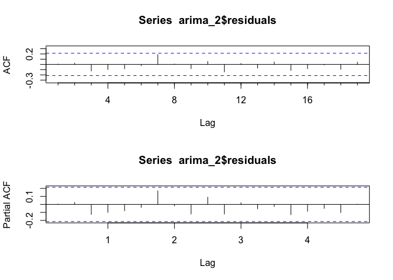
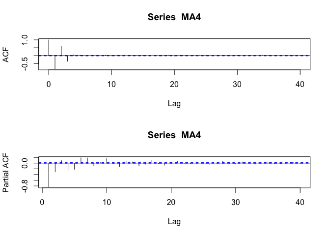

# Lab_10

Yakovenko Ivan
12/29/2020

# Load data

Load dat file from hyper

```r
df <- read.table("https://hyper.mephi.ru/assets/courseware/v1/63356502d843170fc9f9a568c617f11d/asset-v1:MEPhIx+CS712DS+2020Fall+type@asset+block/jj.dat", header = FALSE, col.names = c('EPS'))
head(df)
```

    ##    EPS
    ## 1 0.71
    ## 2 0.63
    ## 3 0.85
    ## 4 0.44
    ## 5 0.61
    ## 6 0.69

    ## Loading required package: ggplot2

    ## Loading required package: forecast

    ## Registered S3 method overwritten by 'quantmod':
    ##   method            from
    ##   as.zoo.data.frame zoo

## a. After obtaining a copy of the dataset, plot the quarterly EPS vs. time. Describe any patterns that you observe.

We get nearly exp pattern. time series is growing up.

```r
df$ts <- ts(df$EPS, start=1960,frequency=4)
plot(df$ts, xlab = "Time (quaters)",
ylab = "EPS (earnings per share)")
```

<!-- -->

## b. In order to perform an ARIMA model, the time series will need to be transformed to remove any trend. Plot the difference of xt and xt-1, for all t &gt; 0.

But this trend of growing doesn’t describe as stationary series which
are needed for ARIMA. For stabilization of data we use “diff” = x(t) -
x(t+1) starts from t=1. Difference called Lag.

```r
plot(diff(df$ts), xlab = "Time (quaters)",
ylab = "EPS (difference)")
```

<!-- -->

We almost detrended our series but its still not so stable And variance
isnt const.

## c. Plot the log10 of the quarterly EPS vs. time and plot the difference of log10(xt ) and log10(xt-1) for all t &gt; 0. Has this adequately detrended the series? Has the variability of the differenced log10(EPS) become more constant?

```r
plot(diff(log10(df$ts)), xlab = "Time (quaters)",
ylab = "EPS (log10(difference))")
```

<!-- -->

And now our plot is more normalized with log. Variance is still not same
on every year but it seems more stable.

## d. Treating the differenced log10 of the EPS series as a stationary series, plot the ACF and PACF of this series. What possible ARIMA models would you consider and why?

Let’s plot ACF and PACF to count ARIMA level.

```r
par(mfrow=c(2,1))
acf(diff(log10(df$ts)))
pacf(diff(log10(df$ts)))
```

<!-- --> We
see peaks are decaying to 0. So here is AR model. PACF says that order
is 1.(p=1) Here we see no zero peaks so no MA model.(q=0) Or we have

d = 0 because we use diff model.

Here we see peaks on ACF every 4 count Therefore period=4

● P is the number of terms in the AR model across the s periods. ● D is
the number of differences applied across the s periods. ● Q is the
number of terms in the MA model across the s periods.

so we get (p,d,q)(P,D,Q)\[s\]

## e. Run the proposed ARIMA models from part d and compare the results. Identify an appropriate model. Justify your choice.

Models are (1,0,0)(1,0,0)4 (2,0,1)(1,0,1)4 - means that we use some MA
model with this one

```r
arima_1 <- Arima(log10(df$ts), order=c(1,0,0),
seasonal = list(order=c(1,0,0),period=4))
arima_1
```

    ## Series: log10(df$ts)
    ## ARIMA(1,0,0)(1,0,0)[4] with non-zero mean
    ##
    ## Coefficients:
    ##          ar1    sar1    mean
    ##       0.8546  0.9487  0.5421
    ## s.e.  0.0565  0.0339  0.3857
    ##
    ## sigma^2 estimated as 0.002084:  log likelihood=135.66
    ## AIC=-263.33   AICc=-262.82   BIC=-253.6

```r
arima_2 <- Arima(log10(df$ts), order=c(2,0,1),
seasonal = list(order=c(1,0,1),period=4))
arima_2
```

    ## Series: log10(df$ts)
    ## ARIMA(2,0,1)(1,0,1)[4] with non-zero mean
    ##
    ## Coefficients:
    ##          ar1     ar2      ma1    sar1     sma1    mean
    ##       0.9647  0.0221  -0.6381  0.9571  -0.2823  0.6194
    ## s.e.  0.2074  0.2010   0.1743  0.0289   0.1219  0.8751
    ##
    ## sigma^2 estimated as 0.001592:  log likelihood=147.61
    ## AIC=-281.23   AICc=-279.75   BIC=-264.21

```r
par(mfrow=c(2,1))
Acf(arima_1$residuals)
pacf(arima_1$residuals)
```

<!-- -->

```r
par(mfrow=c(2,1))
Acf(arima_2$residuals)
pacf(arima_2$residuals)
```

<!-- -->

So we have AIC lower with (2,0,1)(1,0,1)4 and ACF PACF almost fully in
95%. This model is more appropriate. But it has higher SE so may be it
is not the best fit model.

# 4.9

In some cases log isnt the best method to detrend. in general we can use
yt = yt - yt+s where s is season.

# 4.10

If we count correlation between indepv we get 1. correlation between num
itself also equal to 1.

# 4.11 AR(p), p=1,2,3,4

```r
AR4 <- arima.sim(n = 10000, list(ar = c(0.9, -0.5, .2, -.3)))
ts.plot(AR4)
```

<!-- -->

```r
par(mfrow=c(2,1))
acf(AR4)
pacf(AR4)
```

<!-- -->

Here we see ACF is more like _s**i**n_. Max on 4

```r
AR3 <- arima.sim(n = 10000, list(ar = c(0.9, -0.5, .2)))
ts.plot(AR3)
```

<!-- -->

```r
par(mfrow=c(2,1))
acf(AR3)
pacf(AR3)
```

<!-- -->

Max on 3

```r
AR2 <- arima.sim(n = 10000, list(ar = c(0.9, -0.5)))
ts.plot(AR2)
```

<!-- -->

```r
par(mfrow=c(2,1))
acf(AR2)
pacf(AR2)
```

<!-- -->

Max on 2

```r
AR1 <- arima.sim(n = 10000, list(ar = c(0.9)))
ts.plot(AR1)
```

<!-- -->

```r
par(mfrow=c(2,1))
acf(AR1)
pacf(AR1)
```

<!-- -->

Max on 1

\#4.12 MA(q) q=1,2,3,4

```r
MA4 <- arima.sim(n = 10000, list( ma = c(-1.9, 1.7, -1.5, 1.5)))
ts.plot(MA4)
```

<!-- -->

```r
par(mfrow=c(2,1))
acf(MA4)
pacf(MA4)
```

<!-- -->

And here is the same - max on 4

```r
MA3 <- arima.sim(n = 10000, list( ma = c(-1.9, 1.7, -1.5)))
ts.plot(MA3)
```

<!-- -->

```r
par(mfrow=c(2,1))
acf(MA3)
pacf(MA3)
```

<!-- --> Here
we see seasonality. max on 3

```r
MA2 <- arima.sim(n = 10000, list( ma = c(-1.9, 1.7)))
ts.plot(MA2)
```

<!-- -->

```r
par(mfrow=c(2,1))
acf(MA2)
pacf(MA2)
```

<!-- --> max
on 2

```r
MA1 <- arima.sim(n = 10000, list( ma = c(-1.9)))
ts.plot(MA1)
```

<!-- -->

```r
par(mfrow=c(2,1))
acf(MA1)
pacf(MA1)
```

<!-- -->

And max on 1
