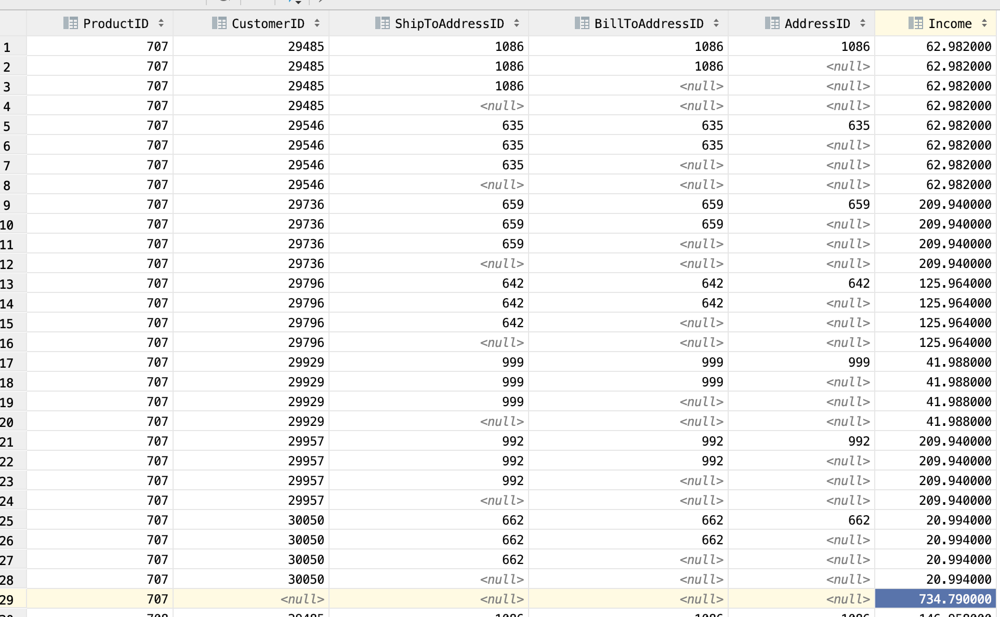

# Task B rollup

Заменил в запросе на rollup

```sql
group by rollup (
    Product.ProductID,
  Customer.CustomerID,
  ShipToAddressID,
  BillToAddressID,
  CustomerAddress.AddressID
    );
```

Вывод такой:



# percent_rank

Используется для относительного ранжирования от 0 до 1
То есть как пример в задании:
| № | Country| Town | % |
|----|--------|------------------|-----|
| 51 | Canada | Ontario | 1 |
| 23 | Canada | Quebec | 0.8 |
| 17 | Canada | British Columbia | 0.6 |
| 13 | Canada | Alberta | 0.4 |
| 1 | Canada | Brunswick | 0 |
| 1 | Canada | Manitoba | 0 |

то есть мы считаем ранк для всех а дальше нормализуем в пределах 0-1
Brunswick и Manitoba получили самый низкий ранк поэтому и выходит что у них 0 (самый низкий ранк)
