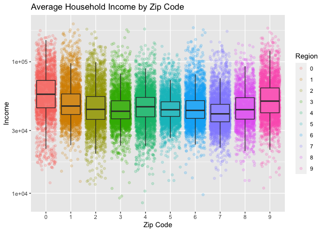

lab\_23
================
Yakovenko Ivan
11/9/2020

# Data Analysis in R

## Load Data

First we need to load our data from file. Let’s see what we get:

``` r
zipIncome <- read.table('https://hyper.mephi.ru/assets/courseware/v1/94f633ca057a1aa84db0364cf4bfa81d/asset-v1:MEPhIx+CS712DS+2020Fall+type@asset+block/zipIncome.txt', header = TRUE, sep = '|', col.names = c('zipCode', 'income'), comment.char = "(")

head(zipIncome, n = 10)
```

    ##    zipCode   income
    ## 1        0     0.00
    ## 2        0     0.00
    ## 3        0     0.00
    ## 4        0     0.00
    ## 5        0     0.00
    ## 6        0 12013.34
    ## 7        0 15079.26
    ## 8        0 15626.57
    ## 9        0 15759.75
    ## 10       0 15795.29

## Analysis

To find median and mean of average **income** we use `summary()`

``` r
tab_summary <- summary(zipIncome)
cat("**For income:**", tab_summary[,2], sep="\n")
```

**For income:** Min. : 0  
1st Qu.: 37644  
Median : 44163  
Mean : 48245  
3rd Qu.: 54373  
Max. :250000

Let’s look at a scatter plot of data. Outlier values are \(\$0\) and
\(\$250000\)

``` r
plot(zipIncome)
```

<!-- -->

To avoid outliers let’s create subset of data where
\(\$7,000 < income < \$200,000\) and build a simple boxplot:

``` r
subset_data <- subset(zipIncome, income>7000 & income < 200000)
tab_subset <- summary(subset_data)
cat("**For income:**", tab_subset[,2], sep="\n")
```

    ## **For income:**
    ## Min.   :  8465  
    ## 1st Qu.: 37755  
    ## Median : 44234  
    ## Mean   : 48465  
    ## 3rd Qu.: 54444  
    ## Max.   :194135

``` r
boxplot(formula=income ~ zipCode, col="white", data = subset_data, main = 'Average Household Income by Zip Code', xlab = 'Zip Code', ylab = 'Income')
```

<!-- -->

**Or with log scale over Y**

``` r
boxplot(income ~ zipCode, col="white", data = subset_data, main = 'Average Household Income by Zip Code', xlab = 'Zip Code', ylab = 'Income', log = 'y')
```

<!-- -->

For the next step we are needed in **ggplot2** package. Let’s check it
and install if it is necessary.

``` r
 if (!require('ggplot2'))
   {
      install.packages('ggplot2', dependencies = TRUE)
      library('ggplot2')
   }
```

    ## Loading required package: ggplot2

### Making plots with ggplot2

``` r
plt <- ggplot(data=subset_data, aes(as.factor(zipCode), income))
plt + geom_point(position='jitter', alpha=0.2) + scale_y_log10()
```

<!-- -->

And colorful ggplot:

``` r
color_plt <- ggplot(data=subset_data, aes(as.factor(zipCode), income))
color_plt <- color_plt + geom_point(aes(color=factor(zipCode)), position='jitter', alpha=0.2) + scale_y_log10()
color_plt <- color_plt + geom_boxplot(aes(group=zipCode), alpha = 0.1, outlier.size = -Inf)
plot(color_plt + labs(title = 'Average Household Income by Zip Code', x = 'Zip Code', y = 'Income', color = 'Region'))
```

<!-- -->

## Conclusion

After basic analysis of this data we can say that 0 and 9 zip codes have
the largest average income.
