Lab\_4
================
Yakovenko Ivan
11/10/2020

First we should load Rdata file and make our table:

``` r
load(url("https://hyper.mephi.ru/assets/courseware/v1/1978112250dbe5fdecb6fd2c07809240/asset-v1:MEPhIx+CS712DS+2020Fall+type@asset+block/income_elec_state.Rdata"))
income_elec_state <- cbind(rownames(income_elec_state), income_elec_state)
mydf <- setNames(income_elec_state, c("state", "mean_household_income", "mean_electricity_usage"))
#rownames(mydf) <- NULL
head(mydf)
```

    ##    state mean_household_income mean_electricity_usage
    ## TN    TN                 48365                   1130
    ## MS    MS                 41466                   1155
    ## MI    MI                 55672                    797
    ## MA    MA                 67152                    784
    ## KS    KS                 49588                   1001
    ## PR    PR                 25227                    641

For the next step we are needed in **ggplot2** package. Let’s check it
and install if it is necessary.

``` r
 if (!require('ggplot2'))
   {
      install.packages('ggplot2', dependencies = TRUE)
      library('ggplot2')
   }
```

    ## Loading required package: ggplot2

Create plot:

``` r
clusters <- kmeans(mydf[,2:3], centers = 10, iter.max = 100, nstart = 200 )

clusters_plot <- ggplot() + geom_point(mydf, mapping=aes(x=mean_household_income, y=mean_electricity_usage, colour=factor(clusters$cluster)), shape=1) + geom_point(mapping = aes(clusters$centers[,1], clusters$centers[,2], size=1), shape=8, size=2)

plot(clusters_plot)
```

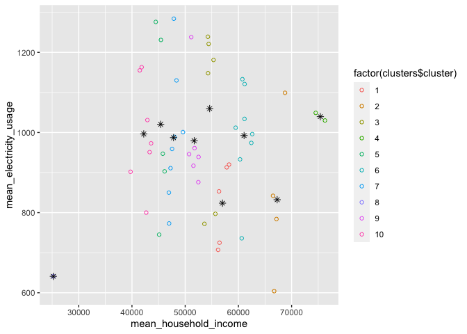<!-- -->

Let’s put names of states:

``` r
 plot(clusters_plot + geom_text(mydf, mapping = aes(mean_household_income, mean_electricity_usage, label = state)))
```

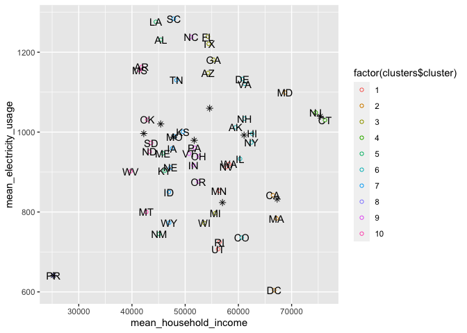<!-- -->

# Count k for kmeans

In first approximation we can suggest that we’re just need to build
several plots with different value of k for k-means and find out that
minimum amount of clusters which still has Puerto Rico in its own
cluster.

``` r
for (suggested_k in c(1:10)) {
  s_clusters <- kmeans(mydf[,2:3], centers = suggested_k, iter.max = 100, nstart = 200 )

  s_clusters_plot <- ggplot() + geom_point(mydf, mapping=aes(x=mean_household_income, y=mean_electricity_usage, colour=factor(s_clusters$cluster)), shape=1) + geom_point(mapping = aes(s_clusters$centers[,1], s_clusters$centers[,2], size=1))

  plot(s_clusters_plot)
}
```

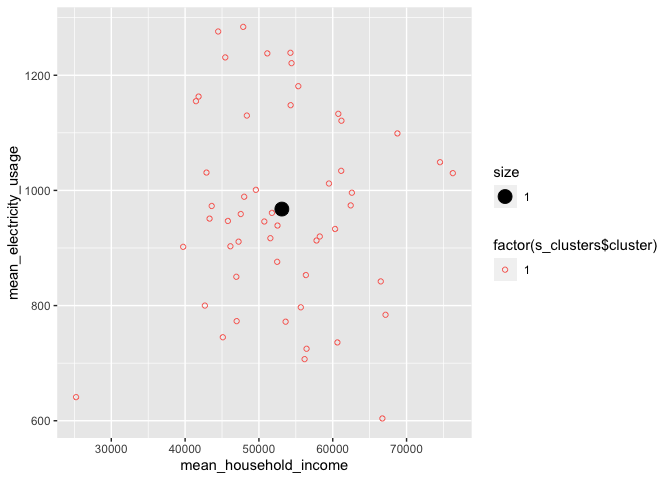<!-- -->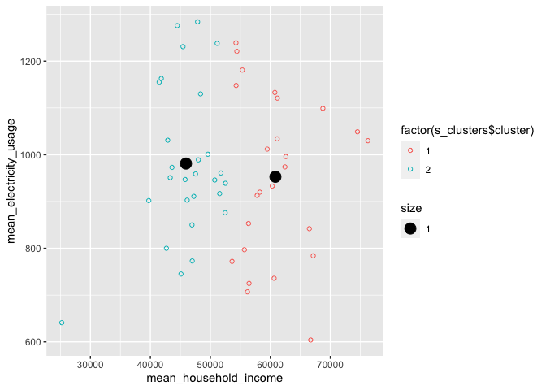<!-- -->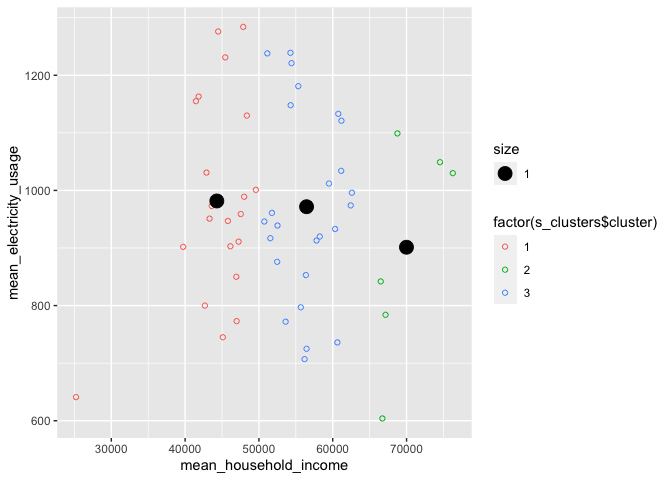<!-- -->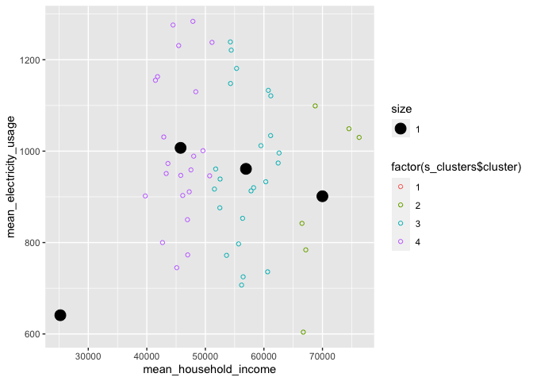<!-- -->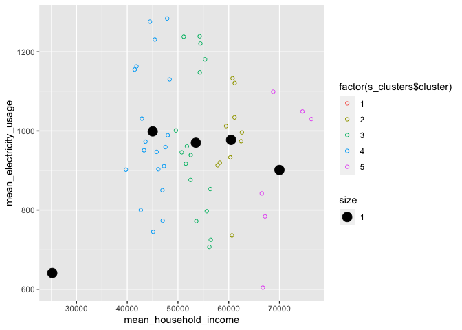<!-- -->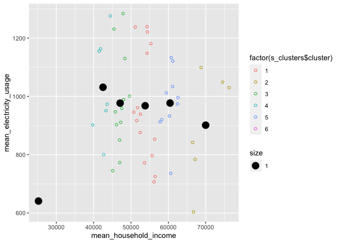<!-- -->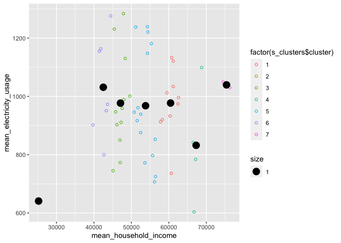<!-- -->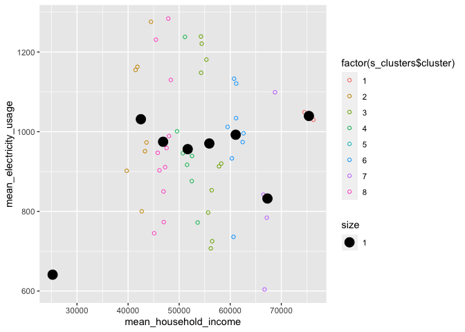<!-- -->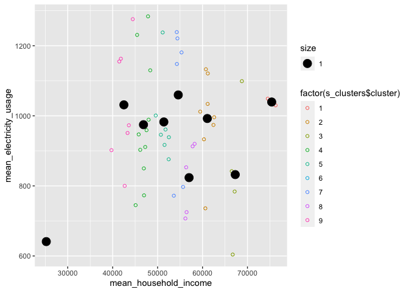<!-- -->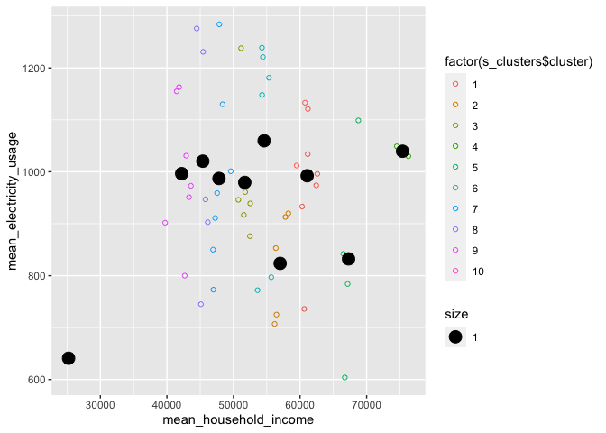<!-- -->

My choice is `4` - minimum k with single cluster of Puerto Rico.

## Elbow method

Another mathematical method to find out the optimal value of `k` is
Elbow method.

``` r
total_withinss <- function(k, dataf) {
  cluster <- kmeans(dataf[2:3], k, nstart=100, iter.max = 100)
  return (cluster$tot.withinss)
}

plot_elbow <- function(dataframe, max_cluster) {
  wss <- sapply(2:max_cluster, total_withinss, dataf=dataframe)
  elbow <-data.frame(max_cluster=2:max_cluster, wss=wss)
  
  ggplot(elbow, aes(x = max_cluster, y = wss)) +
      geom_point() +
      geom_line() + scale_x_continuous(breaks=seq(2, max_cluster, 1)) + labs(title = "Elbow method\n", x = "number of clusters", y = "Total within-clusters sum of square") 
}

plot_elbow(mydf, 15)
```

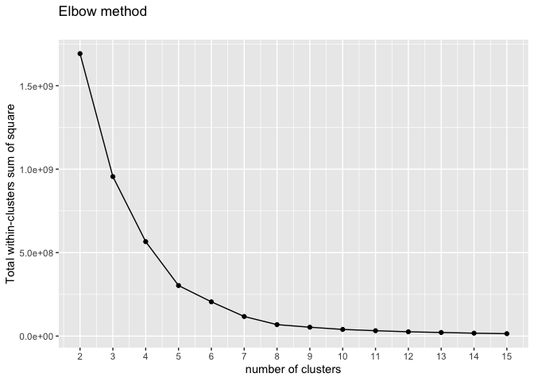<!-- -->

Convert the mean household income and mean electricity usage to a log10
scale and cluster this transformed dataset

``` r
log_income <- log10(mydf$mean_household_income)
log_elec <- log10(mydf$mean_electricity_usage)

log_df <- data.frame(state=mydf$state, income=log_income, elec=log_elec)
head(log_df)
```

    ##   state   income     elec
    ## 1    TN 4.684531 3.053078
    ## 2    MS 4.617692 3.062582
    ## 3    MI 4.745637 2.901458
    ## 4    MA 4.827059 2.894316
    ## 5    KS 4.695377 3.000434
    ## 6    PR 4.401866 2.806858

Create cluster of transformed data:

``` r
log_clusters <- kmeans(log_df[2:3], 5, nstart = 50, iter.max=100)

log_plt <- ggplot() + geom_point(log_df, mapping = aes(income, elec, colour=factor(log_clusters$cluster))) 
plot(log_plt + geom_text(log_df, mapping = aes(income, elec, label = state)))
```

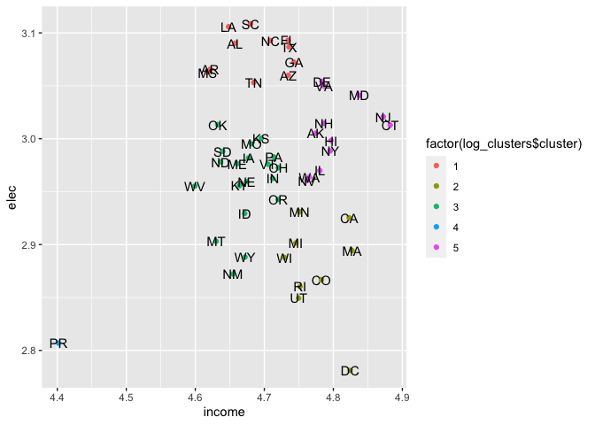<!-- -->

And we get more understandable clusters (4 big and Puerto Rico). And
let’s plot Elbow method:

``` r
plot_elbow(log_df, 20)
```

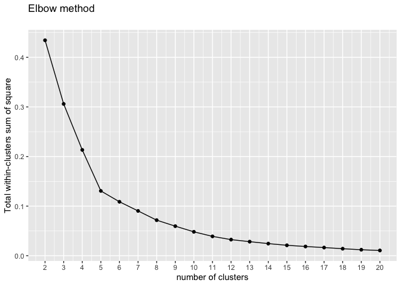<!-- -->

But wait. We have one value (Puerto Rico) which is isolated from others.
Bet it is outlier :) Let’s remove it and reevaluate k:

``` r
cleaned_df <- log_df[log_df$state != 'PR', ] 
plot_elbow(cleaned_df, 20)
```

<!-- -->

So the real optimal k equals `4`. As we predicted earlier.

# Color maps

Install or load maps:

``` r
 if (!require('maps'))
   {
      install.packages('maps', dependencies = TRUE)
      library('maps')
   }
```

    ## Loading required package: maps

``` r
#ban_list <- c('AK', 'HI', 'PR', 'VI', 'AS')
map_order <- c('AL', 'AZ', 'AR', 'CA', 'CO', 'CT', 'DE', 'DC', 'FL',
'GA', 'ID', 'IL', 'IN', 'IA', 'KS', 'KY', 'LA', 'ME',
'MD', 'MA', 'MA', 'MA', 'MI', 'MI', 'MN', 'MS', 'MO',
'MT', 'NE', 'NV', 'NH', 'NJ', 'NM', 'NY', 'NY', 'NY',
'NY', 'NC', 'NC', 'NC', 'ND', 'OH', 'OK', 'OR', 'PA',
'RI', 'SC', 'SD', 'TN', 'TX', 'UT', 'VT', 'VA', 'VA',
'VA', 'WA', 'WA', 'WA', 'WA', 'WA', 'WV', 'WI', 'WY')
rownames(log_df) <- log_df$state
map_clusters <- kmeans(log_df[map_order, 2:3], centers=4, nstart = 100, iter.max=100)
map_color <- map_clusters$cluster[map_order]
map_clusters
```

    ## K-means clustering with 4 clusters of sizes 19, 13, 19, 12
    ## 
    ## Cluster means:
    ##     income     elec
    ## 1 4.671595 2.959619
    ## 2 4.691039 3.082773
    ## 3 4.793262 2.999774
    ## 4 4.781986 2.882285
    ## 
    ## Clustering vector:
    ##   AL   AZ   AR   CA   CO   CT   DE   DC   FL   GA   ID   IL   IN   IA   KS   KY 
    ##    2    2    2    4    4    3    3    4    2    2    1    3    1    1    1    1 
    ##   LA   ME   MD   MA MA.1 MA.2   MI MI.1   MN   MS   MO   MT   NE   NV   NH   NJ 
    ##    2    1    3    4    4    4    4    4    4    2    1    1    1    3    3    3 
    ##   NM   NY NY.1 NY.2 NY.3   NC NC.1 NC.2   ND   OH   OK   OR   PA   RI   SC   SD 
    ##    1    3    3    3    3    2    2    2    1    1    1    1    1    4    2    1 
    ##   TN   TX   UT   VT   VA VA.1 VA.2   WA WA.1 WA.2 WA.3 WA.4   WV   WI   WY 
    ##    2    2    4    1    3    3    3    3    3    3    3    3    1    4    1 
    ## 
    ## Within cluster sum of squares by cluster:
    ## [1] 0.04710286 0.02668046 0.04384823 0.03536854
    ##  (between_SS / total_SS =  75.0 %)
    ## 
    ## Available components:
    ## 
    ## [1] "cluster"      "centers"      "totss"        "withinss"     "tot.withinss"
    ## [6] "betweenss"    "size"         "iter"         "ifault"

``` r
maps::map(database = 'state', col = map_color, fill = TRUE)
```

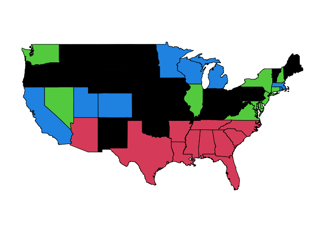<!-- -->

# Hierarchical clustering

``` r
create_linkage <- function(my_method, dataframe, cex, hang) {
  d <- dist(dataframe[,2:3])
  linkage <- hclust(d, method = my_method )
  plot(linkage, cex = cex, hang=hang, main = paste(my_method, " linkage", sep=" "))
  rect.hclust(linkage, k = 5, border = 2:5)
  
  cutted_tree <- cutree(linkage, k = 5)
  link_plot <- ggplot() + geom_point(mydf, mapping = aes(mean_household_income, mean_electricity_usage, colour=factor(cutted_tree))) 
  plot(link_plot + ggtitle(paste("Hierarchical clastering. ", my_method, " linkage", sep=" ")))
}
```

Let’s create Average Linkage:

``` r
create_linkage(my_method="average", dataframe=mydf, cex=0.7, hang=-1)
```

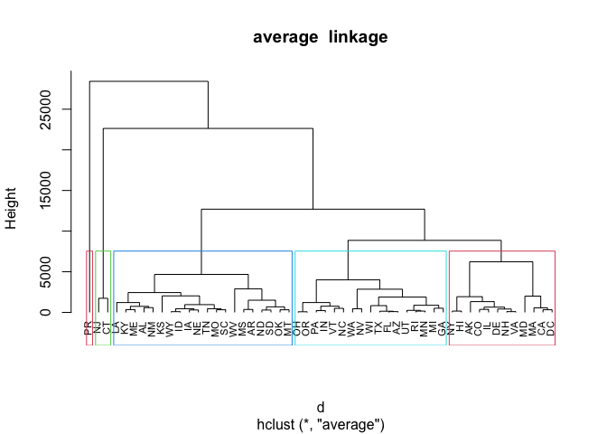<!-- -->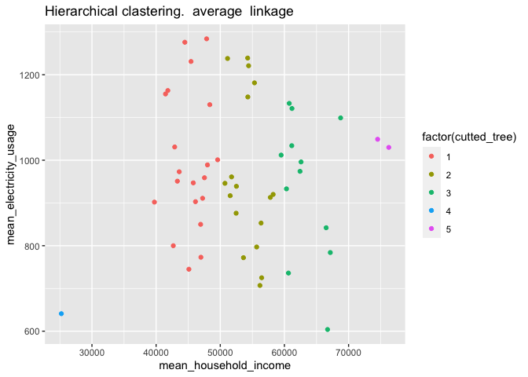<!-- -->

Single:

``` r
create_linkage(my_method="single", dataframe=mydf, cex=0.7, hang=-1)
```

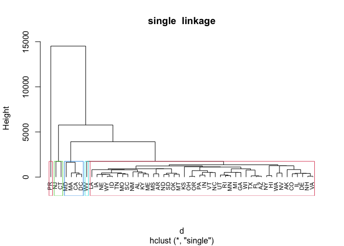<!-- -->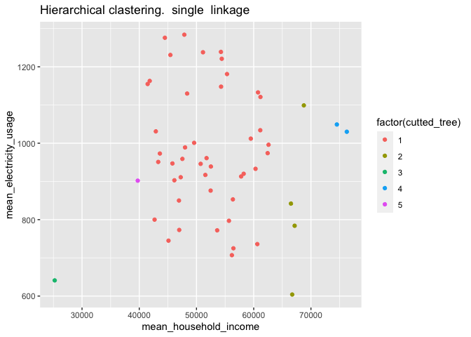<!-- -->

Complete:

``` r
create_linkage(my_method="complete", dataframe=mydf, cex=0.7, hang=-1)
```

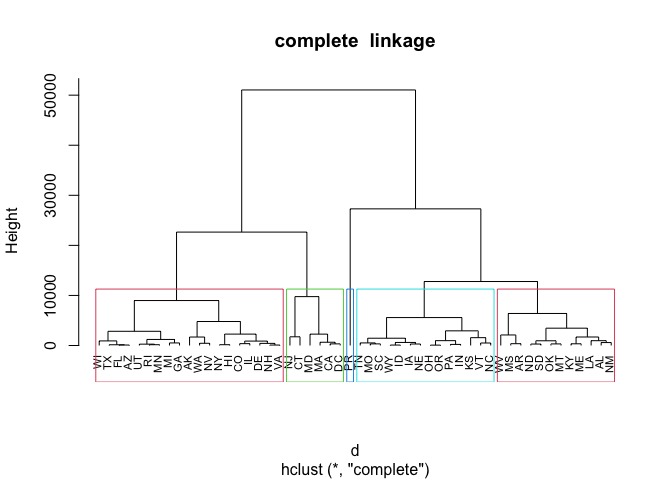<!-- -->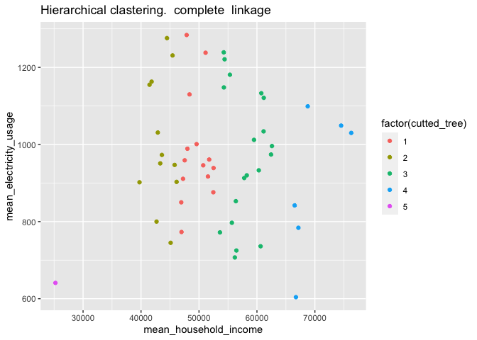<!-- -->

As we can see Puerto Riko is an outlier

## Log10 scaled data

``` r
create_linkage(my_method="complete", dataframe=log_df, cex=0.7, hang=0.3)
```

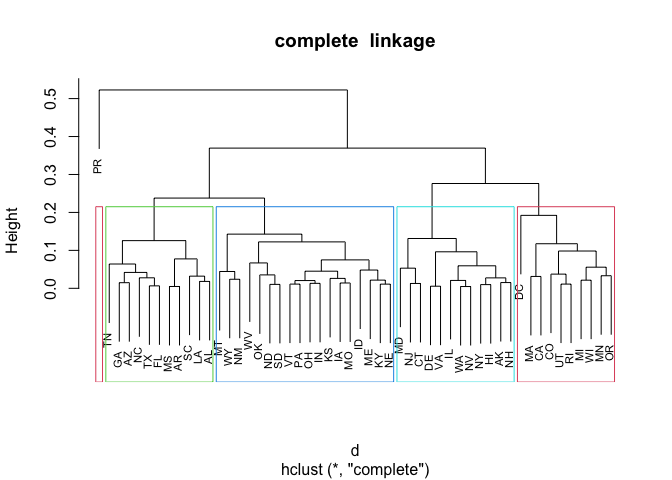<!-- -->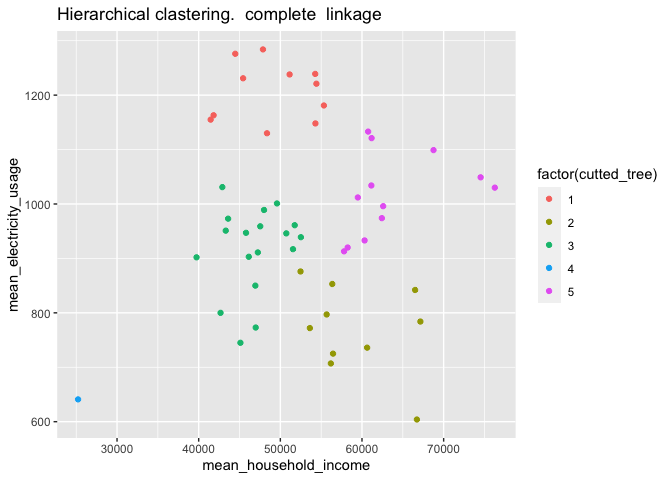<!-- -->

Puerto Rico is separated from others

# Estimate amount of clusters

``` r
 if (!require('cluster') & !require('factoextra'))
   {
      install.packages('cluster', 'factoextra', dependencies = TRUE)
      library(cluster)
      library(factoextra)
   }
```

    ## Loading required package: cluster

    ## 
    ## Attaching package: 'cluster'

    ## The following object is masked from 'package:maps':
    ## 
    ##     votes.repub

    ## Loading required package: factoextra

    ## Welcome! Want to learn more? See two factoextra-related books at https://goo.gl/ve3WBa

## Elbow method

``` r
fviz_nbclust(log_df[,2:3], hcut, method = "wss")
```

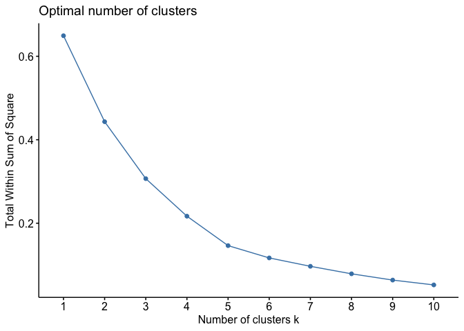<!-- -->

Wss method gives `k=5`.

## Silhouette method

``` r
fviz_nbclust(log_df[,2:3], hcut, method = "silhouette")
```

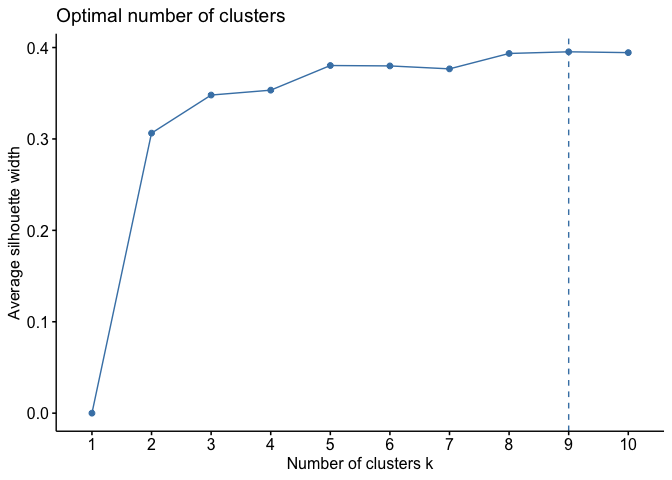<!-- -->

A high average silhouette width indicates a good clustering at `k=9`

## Gap statistic

``` r
gap_res <- clusGap(log_df[,2:3], FUN = hcut, nstart = 200,
                    K.max = 15, B = 50)
fviz_gap_stat(gap_res)
```

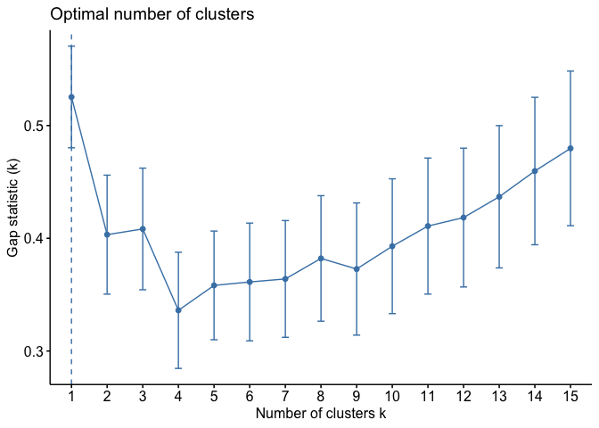<!-- -->

clusGap say that `k=1`.

## Plot for gap

``` r
plot_gap_k <- function(knum)
{
  d <- dist(log_df[,2:3])
  res <- hclust(d, method = "complete" )
  grp <- cutree(res, k = knum)
  fviz_cluster(list(cluster = grp, data = log_df[,2:3]))
}
```

## Plot with k=5

``` r
plot_gap_k(5)
```

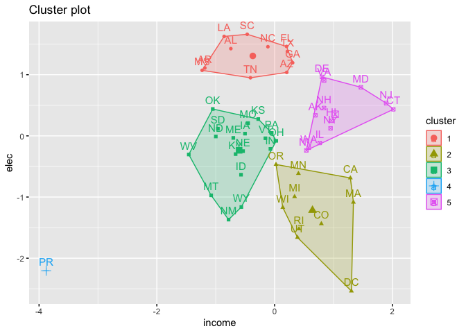<!-- -->

## Plot with k=1

``` r
plot_gap_k(1)
```

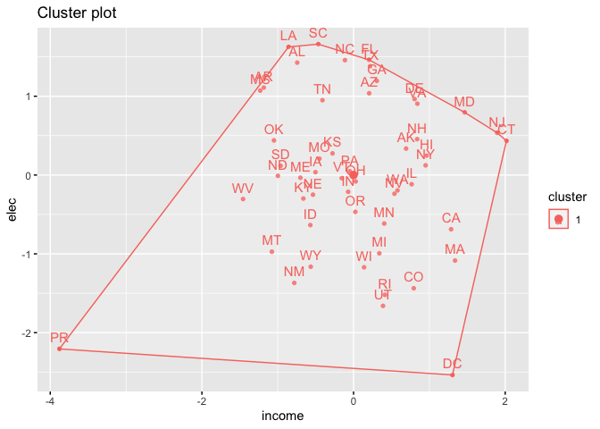<!-- -->

## Graph for k = 9

``` r
plot_gap_k(9)
```

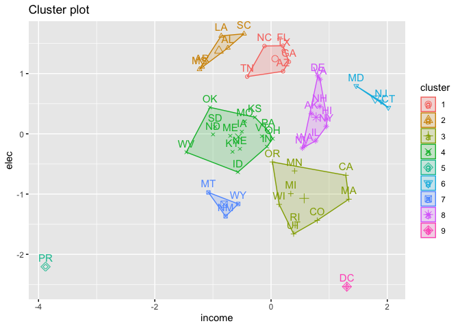<!-- -->

I think the most suitable case is `k=5`: - if `k=1` -\> all data in one
cluster, - if `k=9` -\> there are more other outliers.
