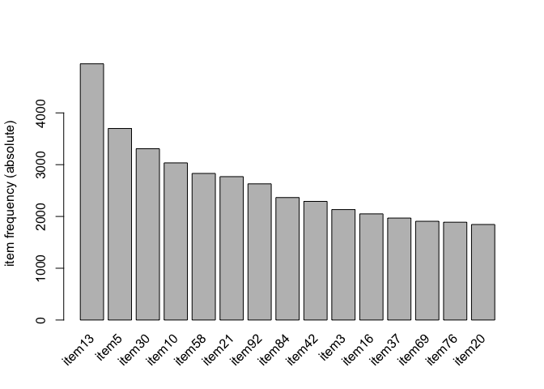
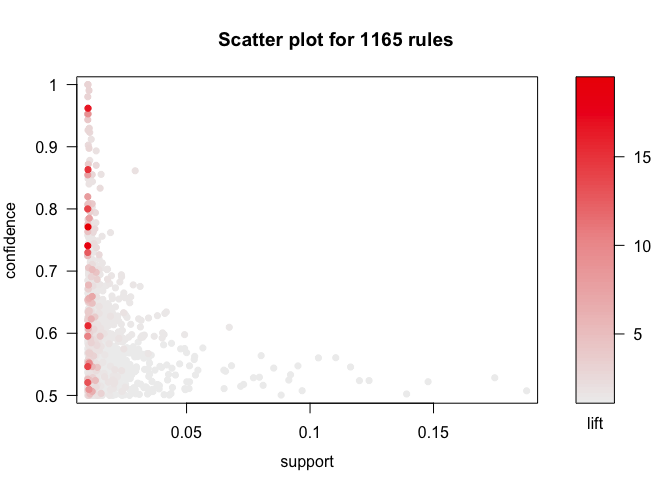
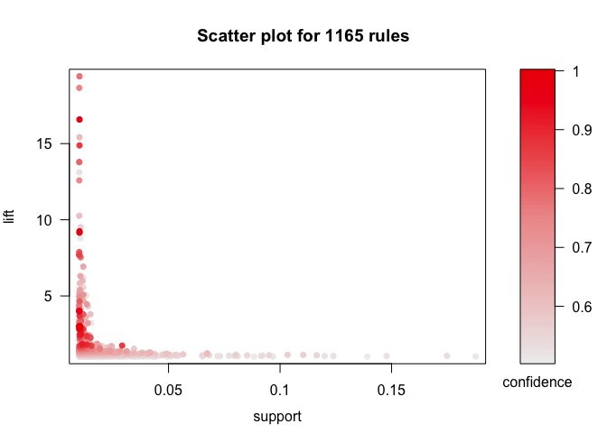
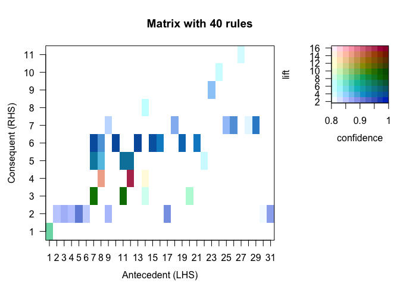
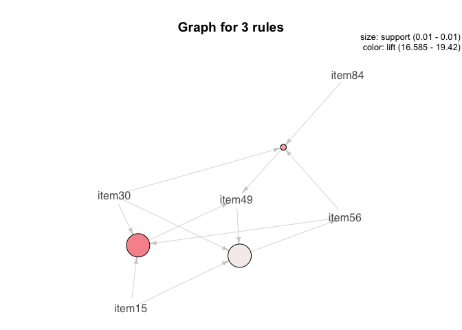

Lab 5
================
Yakovenko Ivan
11/11/2020

    ## Loading required package: ggplot2

    ## Loading required package: arules

    ## Loading required package: Matrix

    ## 
    ## Attaching package: 'arules'

    ## The following objects are masked from 'package:base':
    ## 
    ##     abbreviate, write

    ## Loading required package: arulesViz

    ## Loading required package: grid

First we need to load our data. I’ve used `read.transactions` to read
transaction data from csv.

``` r
transact_data <- read.transactions(
        file = "https://hyper.mephi.ru/assets/courseware/v1/4528e593d5d574a075e15cab1da2383b/asset-v1:MEPhIx+CS712DS+2020Fall+type@asset+block/AssociationRules.csv",
        format = "basket",
        sep = " ",
        rm.duplicates = TRUE
)
summary(transact_data)
```

    ## transactions as itemMatrix in sparse format with
    ##  10000 rows (elements/itemsets/transactions) and
    ##  98 columns (items) and a density of 0.1000643 
    ## 
    ## most frequent items:
    ##  item13   item5  item30  item10  item58 (Other) 
    ##    4948    3699    3308    3035    2831   80242 
    ## 
    ## element (itemset/transaction) length distribution:
    ## sizes
    ##    1    2    3    4    5    6    7    8    9   10   11   12   13   14   15   16 
    ##   17   88  176  319  490  660  858 1045 1132 1120 1079  859  675  520  398  249 
    ##   17   18   19   20   21   22   23   24   25 
    ##  133   97   41   22    7    9    2    1    3 
    ## 
    ##    Min. 1st Qu.  Median    Mean 3rd Qu.    Max. 
    ##   1.000   7.000  10.000   9.806  12.000  25.000 
    ## 
    ## includes extended item information - examples:
    ##    labels
    ## 1   item1
    ## 2  item10
    ## 3 item100

# Data Exploration and Rules Inference

## Frequent item table

``` r
freq_tab <- data.frame(itemFrequency(transact_data, type = "absolute"))
freq_tab <- cbind(rownames(freq_tab), freq_tab)
rownames(freq_tab) <- NULL
names(freq_tab) <- c("item","freq")
freq_tab[freq_tab$freq == max(freq_tab$freq),]
```

    ##     item freq
    ## 6 item13 4948

## Frequent item plot

``` r
itemFrequencyPlot(transact_data, type="absolute", topN=15)
```

<!-- -->

to find max length of transaction:

``` r
max(size(transact_data))
```

    ## [1] 25

# Rules with apriori

``` r
rules_1 <- apriori(transact_data, parameter = list(supp = 0.01, conf = 0.0, target = "rules"))
```

    ## Apriori
    ## 
    ## Parameter specification:
    ##  confidence minval smax arem  aval originalSupport maxtime support minlen
    ##           0    0.1    1 none FALSE            TRUE       5    0.01      1
    ##  maxlen target  ext
    ##      10  rules TRUE
    ## 
    ## Algorithmic control:
    ##  filter tree heap memopt load sort verbose
    ##     0.1 TRUE TRUE  FALSE TRUE    2    TRUE
    ## 
    ## Absolute minimum support count: 100 
    ## 
    ## set item appearances ...[0 item(s)] done [0.00s].
    ## set transactions ...[98 item(s), 10000 transaction(s)] done [0.01s].
    ## sorting and recoding items ... [89 item(s)] done [0.00s].
    ## creating transaction tree ... done [0.00s].
    ## checking subsets of size 1 2 3 4 5 done [0.02s].
    ## writing ... [11524 rule(s)] done [0.00s].
    ## creating S4 object  ... done [0.01s].

``` r
rules_2 <- apriori(transact_data, parameter = list(supp = 0.01, conf = 0.5, target = "rules"))
```

    ## Apriori
    ## 
    ## Parameter specification:
    ##  confidence minval smax arem  aval originalSupport maxtime support minlen
    ##         0.5    0.1    1 none FALSE            TRUE       5    0.01      1
    ##  maxlen target  ext
    ##      10  rules TRUE
    ## 
    ## Algorithmic control:
    ##  filter tree heap memopt load sort verbose
    ##     0.1 TRUE TRUE  FALSE TRUE    2    TRUE
    ## 
    ## Absolute minimum support count: 100 
    ## 
    ## set item appearances ...[0 item(s)] done [0.00s].
    ## set transactions ...[98 item(s), 10000 transaction(s)] done [0.01s].
    ## sorting and recoding items ... [89 item(s)] done [0.00s].
    ## creating transaction tree ... done [0.00s].
    ## checking subsets of size 1 2 3 4 5 done [0.02s].
    ## writing ... [1165 rule(s)] done [0.00s].
    ## creating S4 object  ... done [0.00s].

``` r
cat("For sup=1% & conf=0%: ", length(rules_1), "\n")
```

    ## For sup=1% & conf=0%:  11524

``` r
cat("For sup=1% & conf=50%: ", length(rules_2), "\n")
```

    ## For sup=1% & conf=50%:  1165

# Rules Vusialization

## Rules Graphical Analysis

support x confidence with shading on lift

``` r
plot(rules_2, method = "scatterplot", measure = c('support', 'confidence'), shading = 'lift', jitter = 0)
```

<!-- -->

support x lift with shading on confidence

``` r
plot(rules_2, method = "scatterplot", measure = c('support', 'lift'), shading = 'confidence', jitter = 0)
```

<!-- -->

## Three rules

``` r
rules_3 <- apriori(transact_data, parameter = list(supp = 0.1, conf = 0.5))
```

    ## Apriori
    ## 
    ## Parameter specification:
    ##  confidence minval smax arem  aval originalSupport maxtime support minlen
    ##         0.5    0.1    1 none FALSE            TRUE       5     0.1      1
    ##  maxlen target  ext
    ##      10  rules TRUE
    ## 
    ## Algorithmic control:
    ##  filter tree heap memopt load sort verbose
    ##     0.1 TRUE TRUE  FALSE TRUE    2    TRUE
    ## 
    ## Absolute minimum support count: 1000 
    ## 
    ## set item appearances ...[0 item(s)] done [0.00s].
    ## set transactions ...[98 item(s), 10000 transaction(s)] done [0.01s].
    ## sorting and recoding items ... [39 item(s)] done [0.00s].
    ## creating transaction tree ... done [0.00s].
    ## checking subsets of size 1 2 3 done [0.00s].
    ## writing ... [9 rule(s)] done [0.00s].
    ## creating S4 object  ... done [0.00s].

``` r
inspect(head(rules_3, n = 3, by='lift', decreasing = TRUE))
```

    ##     lhs         rhs      support confidence coverage lift     count
    ## [1] {item37} => {item13} 0.1104  0.5606907  0.1969   1.133166 1104 
    ## [2] {item20} => {item13} 0.1034  0.5604336  0.1845   1.132647 1034 
    ## [3] {item3}  => {item13} 0.1164  0.5457103  0.2133   1.102891 1164

## Coincidental rules

Identify the most interesting rules by extracting the rules in which the
Confidence is \>0.8. Observe the output of the data table for the most
interesting rules.

Sort the rules stating the highest lift first. Provide the 10 rules with
the lowest lift. Do they appear to be coincidental (Use lift = 2 as
baseline for coincidence)?

But if we get lift 2 as base we get only 8 values?

``` r
rules_4 <- apriori(transact_data, parameter = list(supp = 0.01, conf = 0.8))
tab_rules4 <- inspect(head(rules_4, n = -1, by='lift', decreasing = TRUE))
```

``` r
tab_rules4[tab_rules4$lift<2.0,]
```

    ##                        lhs         rhs support confidence coverage     lift
    ## [32]       {item20,item23} => {item13}  0.0114  0.9120000   0.0125 1.843169
    ## [33] {item5,item82,item99} => {item13}  0.0134  0.8933333   0.0150 1.805443
    ## [34] {item3,item84,item95} => {item13}  0.0108  0.8780488   0.0123 1.774553
    ## [35]              {item23} => {item13}  0.0292  0.8613569   0.0339 1.740818
    ## [36]       {item82,item99} => {item13}  0.0154  0.8555556   0.0180 1.729094
    ## [37]       {item10,item44} => {item13}  0.0101  0.8487395   0.0119 1.715318
    ## [38]              {item83} => {item13}  0.0119  0.8439716   0.0141 1.705682
    ## [39]        {item23,item5} => {item13}  0.0105  0.8400000   0.0125 1.697656
    ##      count
    ## [32]   114
    ## [33]   134
    ## [34]   108
    ## [35]   292
    ## [36]   154
    ## [37]   101
    ## [38]   119
    ## [39]   105

## Matrix

``` r
plot(rules_4, shading = c('lift', 'confidence'), method = 'matrix')
```

    ## Itemsets in Antecedent (LHS)
    ##  [1] "{item55}"               "{item83}"               "{item23}"              
    ##  [4] "{item10,item44}"        "{item20,item23}"        "{item23,item5}"        
    ##  [7] "{item49,item56}"        "{item15,item49}"        "{item82,item99}"       
    ## [10] "{item15,item49,item56}" "{item30,item49,item56}" "{item15,item30,item49}"
    ## [13] "{item49,item56,item84}" "{item30,item49,item84}" "{item15,item49,item84}"
    ## [16] "{item49,item77,item84}" "{item5,item82,item99}"  "{item13,item82,item99}"
    ## [19] "{item15,item56,item77}" "{item30,item56,item77}" "{item15,item56,item84}"
    ## [22] "{item15,item30,item56}" "{item22,item3,item41}"  "{item10,item22,item41}"
    ## [25] "{item25,item34,item77}" "{item16,item34,item77}" "{item20,item25,item41}"
    ## [28] "{item16,item25,item77}" "{item16,item61,item77}" "{item30,item95,item96}"
    ## [31] "{item3,item84,item95}" 
    ## Itemsets in Consequent (RHS)
    ##  [1] "{item34}" "{item13}" "{item15}" "{item56}" "{item84}" "{item30}"
    ##  [7] "{item5}"  "{item77}" "{item10}" "{item3}"  "{item92}"

<!-- -->

Extract the three rules with the highest lift.

``` r
tab_rules4[1:3,]
```

    ##                        lhs         rhs support confidence coverage     lift
    ## [1] {item15,item30,item49} => {item56}  0.0101  0.9619048   0.0105 16.58456
    ## [2]        {item15,item49} => {item56}  0.0101  0.8632479   0.0117 14.88358
    ## [3] {item30,item49,item84} => {item56}  0.0100  0.8000000   0.0125 13.79310
    ##     count
    ## [1]   101
    ## [2]   101
    ## [3]   100

## Graph

``` r
rules_5 <- apriori(transact_data, parameter = list(supp = 0.01, conf = 0.5))
```

    ## Apriori
    ## 
    ## Parameter specification:
    ##  confidence minval smax arem  aval originalSupport maxtime support minlen
    ##         0.5    0.1    1 none FALSE            TRUE       5    0.01      1
    ##  maxlen target  ext
    ##      10  rules TRUE
    ## 
    ## Algorithmic control:
    ##  filter tree heap memopt load sort verbose
    ##     0.1 TRUE TRUE  FALSE TRUE    2    TRUE
    ## 
    ## Absolute minimum support count: 100 
    ## 
    ## set item appearances ...[0 item(s)] done [0.00s].
    ## set transactions ...[98 item(s), 10000 transaction(s)] done [0.01s].
    ## sorting and recoding items ... [89 item(s)] done [0.00s].
    ## creating transaction tree ... done [0.01s].
    ## checking subsets of size 1 2 3 4 5 done [0.02s].
    ## writing ... [1165 rule(s)] done [0.00s].
    ## creating S4 object  ... done [0.00s].

``` r
rules_graph <- head(rules_5, n = 3, by = 'lift')
plot(rules_graph, method = 'graph')
```

<!-- -->

## Training and Test Sets

``` r
training_data <- transact_data[1:8000,]
test_data <- transact_data[8001:10000,]

training_rules <- apriori(training_data, parameter = list(supp = 0.01, conf = 0.1))
```

    ## Apriori
    ## 
    ## Parameter specification:
    ##  confidence minval smax arem  aval originalSupport maxtime support minlen
    ##         0.1    0.1    1 none FALSE            TRUE       5    0.01      1
    ##  maxlen target  ext
    ##      10  rules TRUE
    ## 
    ## Algorithmic control:
    ##  filter tree heap memopt load sort verbose
    ##     0.1 TRUE TRUE  FALSE TRUE    2    TRUE
    ## 
    ## Absolute minimum support count: 80 
    ## 
    ## set item appearances ...[0 item(s)] done [0.00s].
    ## set transactions ...[98 item(s), 8000 transaction(s)] done [0.01s].
    ## sorting and recoding items ... [89 item(s)] done [0.00s].
    ## creating transaction tree ... done [0.00s].
    ## checking subsets of size 1 2 3 4 5 done [0.01s].
    ## writing ... [10786 rule(s)] done [0.00s].
    ## creating S4 object  ... done [0.01s].

``` r
test_rules <- apriori(test_data, parameter = list(supp = 0.01, conf = 0.1))
```

    ## Apriori
    ## 
    ## Parameter specification:
    ##  confidence minval smax arem  aval originalSupport maxtime support minlen
    ##         0.1    0.1    1 none FALSE            TRUE       5    0.01      1
    ##  maxlen target  ext
    ##      10  rules TRUE
    ## 
    ## Algorithmic control:
    ##  filter tree heap memopt load sort verbose
    ##     0.1 TRUE TRUE  FALSE TRUE    2    TRUE
    ## 
    ## Absolute minimum support count: 20 
    ## 
    ## set item appearances ...[0 item(s)] done [0.00s].
    ## set transactions ...[98 item(s), 2000 transaction(s)] done [0.00s].
    ## sorting and recoding items ... [89 item(s)] done [0.00s].
    ## creating transaction tree ... done [0.00s].
    ## checking subsets of size 1 2 3 4 5 done [0.00s].
    ## writing ... [12276 rule(s)] done [0.00s].
    ## creating S4 object  ... done [0.00s].

``` r
union_dt_1 <- DATAFRAME(intersect(training_rules, test_rules))
union_dt_2 <- DATAFRAME(intersect(test_rules, training_rules))
```

``` r
names(union_dt_1) <- c("LHS","RHS","support_test","confidence_test","coverage_test","lift_test", "count_test")
```

``` r
res <- merge(union_dt_1, union_dt_2)
head(res[c('LHS', 'RHS', 'support', 'support_test', 'confidence', 'confidence_test')], n=10)
```

    ##    LHS      RHS  support support_test confidence confidence_test
    ## 1   {}  {item1} 0.170625       0.1765   0.170625          0.1765
    ## 2   {} {item10} 0.302125       0.3090   0.302125          0.3090
    ## 3   {} {item13} 0.492500       0.5040   0.492500          0.5040
    ## 4   {} {item15} 0.103125       0.1080   0.103125          0.1080
    ## 5   {} {item16} 0.206250       0.2000   0.206250          0.2000
    ## 6   {} {item20} 0.185125       0.1820   0.185125          0.1820
    ## 7   {} {item21} 0.276500       0.2785   0.276500          0.2785
    ## 8   {} {item24} 0.111000       0.1080   0.111000          0.1080
    ## 9   {} {item25} 0.122125       0.1385   0.122125          0.1385
    ## 10  {} {item28} 0.139750       0.1520   0.139750          0.1520

Training set = 10786 rules Test set = 12276 rules Intersection = 8938
rules

``` r
summary(res[c('support', 'support_test', 'confidence', 'confidence_test')])
```

    ##     support         support_test       confidence     confidence_test 
    ##  Min.   :0.01000   Min.   :0.01000   Min.   :0.1000   Min.   :0.1000  
    ##  1st Qu.:0.01225   1st Qu.:0.01250   1st Qu.:0.1853   1st Qu.:0.1857  
    ##  Median :0.01512   Median :0.01550   Median :0.2614   Median :0.2649  
    ##  Mean   :0.02043   Mean   :0.02081   Mean   :0.2938   Mean   :0.2972  
    ##  3rd Qu.:0.02175   3rd Qu.:0.02200   3rd Qu.:0.3712   3rd Qu.:0.3763  
    ##  Max.   :0.49250   Max.   :0.50400   Max.   :0.9140   Max.   :1.0000

So we get:

support\_test Mean :`0.02081` support Mean :`0.02043` confidence\_test
Mean :`0.2972` confidence Mean :`0.2938`

And conclude that results of smaller test set is respond to our training
set.
