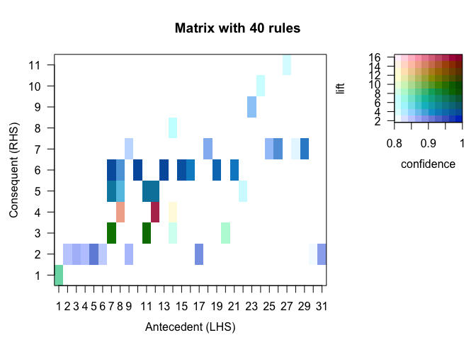
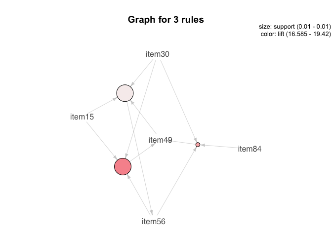

Lab 5
================
Yakovenko Ivan
11/11/2020

    ## Loading required package: ggplot2

    ## Loading required package: arules

    ## Loading required package: Matrix

    ## 
    ## Attaching package: 'arules'

    ## The following objects are masked from 'package:base':
    ## 
    ##     abbreviate, write

    ## Loading required package: arulesViz

    ## Loading required package: grid

First we need to load our data. I’ve used `read.transactions` to read
transaction data from csv.

``` r
transact_data <- read.transactions(
        file = "https://hyper.mephi.ru/assets/courseware/v1/4528e593d5d574a075e15cab1da2383b/asset-v1:MEPhIx+CS712DS+2020Fall+type@asset+block/AssociationRules.csv",
        format = "basket",
        sep = " "
)
transact_data
```

    ## transactions in sparse format with
    ##  10000 transactions (rows) and
    ##  98 items (columns)

``` r
summary(transact_data)
```

    ## transactions as itemMatrix in sparse format with
    ##  10000 rows (elements/itemsets/transactions) and
    ##  98 columns (items) and a density of 0.1000643 
    ## 
    ## most frequent items:
    ##  item13   item5  item30  item10  item58 (Other) 
    ##    4948    3699    3308    3035    2831   80242 
    ## 
    ## element (itemset/transaction) length distribution:
    ## sizes
    ##    1    2    3    4    5    6    7    8    9   10   11   12   13   14   15   16 
    ##   17   88  176  319  490  660  858 1045 1132 1120 1079  859  675  520  398  249 
    ##   17   18   19   20   21   22   23   24   25 
    ##  133   97   41   22    7    9    2    1    3 
    ## 
    ##    Min. 1st Qu.  Median    Mean 3rd Qu.    Max. 
    ##   1.000   7.000  10.000   9.806  12.000  25.000 
    ## 
    ## includes extended item information - examples:
    ##    labels
    ## 1   item1
    ## 2  item10
    ## 3 item100

# Data Exploration and Rules Inference

## Frequent item table

to find most frequent item we find item with max freq

``` r
freq_tab <- data.frame(itemFrequency(transact_data, type = "absolute"))
freq_tab <- cbind(rownames(freq_tab), freq_tab)
rownames(freq_tab) <- NULL
names(freq_tab) <- c("item","freq")
freq_tab[freq_tab$freq == max(freq_tab$freq),]
```

##     item freq
## 6 item13 4948

## Frequent item plot

``` r
itemFrequencyPlot(transact_data, type="absolute", topN=15)
```

<!-- -->

To find max length of transaction:

``` r
max(size(transact_data))
```

## [1] 25

# Rules with apriori

Mine the Association rules with a minimum Support of 1% and a minimum
Confidence of 0%.

``` r
rules_1 <- apriori(transact_data, parameter = list(supp = 0.01, conf = 0.0, target = "rules"))
```

    ## Apriori
    ## 
    ## Parameter specification:
    ##  confidence minval smax arem  aval originalSupport maxtime support minlen
    ##           0    0.1    1 none FALSE            TRUE       5    0.01      1
    ##  maxlen target  ext
    ##      10  rules TRUE
    ## 
    ## Algorithmic control:
    ##  filter tree heap memopt load sort verbose
    ##     0.1 TRUE TRUE  FALSE TRUE    2    TRUE
    ## 
    ## Absolute minimum support count: 100 
    ## 
    ## set item appearances ...[0 item(s)] done [0.00s].
    ## set transactions ...[98 item(s), 10000 transaction(s)] done [0.01s].
    ## sorting and recoding items ... [89 item(s)] done [0.00s].
    ## creating transaction tree ... done [0.00s].
    ## checking subsets of size 1 2 3 4 5 done [0.02s].
    ## writing ... [11524 rule(s)] done [0.00s].
    ## creating S4 object  ... done [0.00s].

``` r
cat("For sup=1% & conf=0%: ", length(rules_1), "\n")
```

## For sup=1% & conf=0%:  11524

How many rules are observed when the minimum confidence is 50%.

``` r
rules_2 <- apriori(transact_data, parameter = list(supp = 0.01, conf = 0.5, target = "rules"))
```

    ## Apriori
    ## 
    ## Parameter specification:
    ##  confidence minval smax arem  aval originalSupport maxtime support minlen
    ##         0.5    0.1    1 none FALSE            TRUE       5    0.01      1
    ##  maxlen target  ext
    ##      10  rules TRUE
    ## 
    ## Algorithmic control:
    ##  filter tree heap memopt load sort verbose
    ##     0.1 TRUE TRUE  FALSE TRUE    2    TRUE
    ## 
    ## Absolute minimum support count: 100 
    ## 
    ## set item appearances ...[0 item(s)] done [0.00s].
    ## set transactions ...[98 item(s), 10000 transaction(s)] done [0.01s].
    ## sorting and recoding items ... [89 item(s)] done [0.00s].
    ## creating transaction tree ... done [0.00s].
    ## checking subsets of size 1 2 3 4 5 done [0.02s].
    ## writing ... [1165 rule(s)] done [0.00s].
    ## creating S4 object  ... done [0.00s].

``` r
cat("For sup=1% & conf=50%: ", length(rules_2), "\n")
```

## For sup=1% & conf=50%:  1165

# Rules Vusialization

## Rules Graphical Analysis

Create a scatter plot comparing the parameters support and confidence on
the axis, and lift with shading.

``` r
plot(rules_2, method = "scatterplot", measure = c('support', 'confidence'), shading = 'lift', jitter = 0)
```

<!-- -->

*Where are the rules located that would be considered interesting and
useful?* High lift & confidence, red and higher points

Create a scatter plot measuring support vs. lift; record your
observations.

``` r
plot(rules_2, method = "scatterplot", measure = c('support', 'lift'), shading = 'confidence', jitter = 0)
```

<!-- -->

*Create a scatter plot measuring support vs. lift; record your
observations.* Red and higher points

## One downside to the Apriori algorithm, is that extraneous rules can be generated that are not particularly useful. Identify where these rules are located on the graph. Explain the relationship between the expected observation of these itemsets and the actual observation of the itemsets.

With low lift & support, at right bottom of the graph and gray colored

## Three rules

``` r
rules_3 <- apriori(transact_data, parameter = list(supp = 0.1, conf = 0.0, target = "rules"))
```

    ## Apriori
    ## 
    ## Parameter specification:
    ##  confidence minval smax arem  aval originalSupport maxtime support minlen
    ##           0    0.1    1 none FALSE            TRUE       5     0.1      1
    ##  maxlen target  ext
    ##      10  rules TRUE
    ## 
    ## Algorithmic control:
    ##  filter tree heap memopt load sort verbose
    ##     0.1 TRUE TRUE  FALSE TRUE    2    TRUE
    ## 
    ## Absolute minimum support count: 1000 
    ## 
    ## set item appearances ...[0 item(s)] done [0.00s].
    ## set transactions ...[98 item(s), 10000 transaction(s)] done [0.01s].
    ## sorting and recoding items ... [39 item(s)] done [0.00s].
    ## creating transaction tree ... done [0.00s].
    ## checking subsets of size 1 2 3 done [0.00s].
    ## writing ... [73 rule(s)] done [0.00s].
    ## creating S4 object  ... done [0.00s].

``` r
inspect(head(rules_3, n = 3, by='confidence', decreasing = TRUE))
```

    ##     lhs         rhs      support confidence coverage lift     count
    ## [1] {item37} => {item13} 0.1104  0.5606907  0.1969   1.133166 1104 
    ## [2] {item20} => {item13} 0.1034  0.5604336  0.1845   1.132647 1034 
    ## [3] {item3}  => {item13} 0.1164  0.5457103  0.2133   1.102891 1164

If we look at the graph, we notice tree points with `support >= 0.1` and
high confidence and `lift ~ 1`. Lift = 1 means that this is coincidental
rules.

## Coincidental rules

Identify the most interesting rules by extracting the rules in which the
Confidence is \>0.8. Observe the output of the data table for the most
interesting rules.

Sort the rules stating the highest lift first. Provide the 10 rules with
the lowest lift. Do they appear to be coincidental (Use lift = 2 as
baseline for coincidence)?

But if we get lift 2 as base we get only 9 values?

``` r
rules_4 <- apriori(transact_data, parameter = list(supp = 0.01, conf = 0.8, target = "rules"))
tab_rules4 <- inspect(tail(sort(rules_4, by='lift', decreasing = TRUE), n=10))
```

## Matrix

``` r
plot(rules_4, shading = c('lift', 'confidence'), method = 'matrix')
```

    ## Itemsets in Antecedent (LHS)
    ##  [1] "{item55}"               "{item83}"               "{item23}"              
    ##  [4] "{item10,item44}"        "{item20,item23}"        "{item23,item5}"        
    ##  [7] "{item49,item56}"        "{item15,item49}"        "{item82,item99}"       
    ## [10] "{item15,item49,item56}" "{item30,item49,item56}" "{item15,item30,item49}"
    ## [13] "{item49,item56,item84}" "{item30,item49,item84}" "{item15,item49,item84}"
    ## [16] "{item49,item77,item84}" "{item5,item82,item99}"  "{item13,item82,item99}"
    ## [19] "{item15,item56,item77}" "{item30,item56,item77}" "{item15,item56,item84}"
    ## [22] "{item15,item30,item56}" "{item22,item3,item41}"  "{item10,item22,item41}"
    ## [25] "{item25,item34,item77}" "{item16,item34,item77}" "{item20,item25,item41}"
    ## [28] "{item16,item25,item77}" "{item16,item61,item77}" "{item30,item95,item96}"
    ## [31] "{item3,item84,item95}" 
    ## Itemsets in Consequent (RHS)
    ##  [1] "{item34}" "{item13}" "{item15}" "{item56}" "{item84}" "{item30}"
    ##  [7] "{item5}"  "{item77}" "{item10}" "{item3}"  "{item92}"

<!-- -->

## Identify these rules and explain their appearance.

Green & pink & red squares =\> high lift & confidence

## What can you infer about rules represented by a dark blue color?

Lift \~= 1 and high confidence mean that these are coincidental rules.

Extract the three rules with the highest lift.

``` r
tab_rules4 <- inspect(head(sort(rules_4, by='lift', decreasing = TRUE), n=3))
```

    ##     lhs                       rhs      support confidence coverage lift    
    ## [1] {item15,item30,item49} => {item56} 0.0101  0.9619048  0.0105   16.58456
    ## [2] {item15,item49}        => {item56} 0.0101  0.8632479  0.0117   14.88358
    ## [3] {item30,item49,item84} => {item56} 0.0100  0.8000000  0.0125   13.79310
    ##     count
    ## [1] 101  
    ## [2] 101  
    ## [3] 100

## Graph

``` r
rules_5 <- apriori(transact_data, parameter = list(supp = 0.01, conf = 0.5, target = "rules"))
```

    ## Apriori
    ## 
    ## Parameter specification:
    ##  confidence minval smax arem  aval originalSupport maxtime support minlen
    ##         0.5    0.1    1 none FALSE            TRUE       5    0.01      1
    ##  maxlen target  ext
    ##      10  rules TRUE
    ## 
    ## Algorithmic control:
    ##  filter tree heap memopt load sort verbose
    ##     0.1 TRUE TRUE  FALSE TRUE    2    TRUE
    ## 
    ## Absolute minimum support count: 100 
    ## 
    ## set item appearances ...[0 item(s)] done [0.00s].
    ## set transactions ...[98 item(s), 10000 transaction(s)] done [0.01s].
    ## sorting and recoding items ... [89 item(s)] done [0.00s].
    ## creating transaction tree ... done [0.00s].
    ## checking subsets of size 1 2 3 4 5 done [0.02s].
    ## writing ... [1165 rule(s)] done [0.00s].
    ## creating S4 object  ... done [0.00s].

``` r
rules_graph <- head(rules_5, n = 3, by = 'lift')
inspect(rules_graph)
```

    ##     lhs                       rhs      support confidence coverage lift    
    ## [1] {item15,item30,item56} => {item49} 0.0101  0.7709924  0.0131   19.42046
    ## [2] {item30,item56,item84} => {item49} 0.0100  0.7407407  0.0135   18.65846
    ## [3] {item15,item30,item49} => {item56} 0.0101  0.9619048  0.0105   16.58456
    ##     count
    ## [1] 101  
    ## [2] 100  
    ## [3] 101

``` r
plot(rules_graph, method = 'graph')
```

<!-- -->

## Training and Test Sets

``` r
training_data <- transact_data[1:8000,]
test_data <- transact_data[8001:10000,]

training_rules <- apriori(training_data, parameter = list(supp = 0.01, conf = 0.1, target = "rules"))
```

    ## Apriori
    ## 
    ## Parameter specification:
    ##  confidence minval smax arem  aval originalSupport maxtime support minlen
    ##         0.1    0.1    1 none FALSE            TRUE       5    0.01      1
    ##  maxlen target  ext
    ##      10  rules TRUE
    ## 
    ## Algorithmic control:
    ##  filter tree heap memopt load sort verbose
    ##     0.1 TRUE TRUE  FALSE TRUE    2    TRUE
    ## 
    ## Absolute minimum support count: 80 
    ## 
    ## set item appearances ...[0 item(s)] done [0.00s].
    ## set transactions ...[98 item(s), 8000 transaction(s)] done [0.01s].
    ## sorting and recoding items ... [89 item(s)] done [0.00s].
    ## creating transaction tree ... done [0.00s].
    ## checking subsets of size 1 2 3 4 5 done [0.02s].
    ## writing ... [10786 rule(s)] done [0.00s].
    ## creating S4 object  ... done [0.00s].

``` r
test_rules <- apriori(test_data, parameter = list(supp = 0.01, conf = 0.1, target = "rules"))
```

    ## Apriori
    ## 
    ## Parameter specification:
    ##  confidence minval smax arem  aval originalSupport maxtime support minlen
    ##         0.1    0.1    1 none FALSE            TRUE       5    0.01      1
    ##  maxlen target  ext
    ##      10  rules TRUE
    ## 
    ## Algorithmic control:
    ##  filter tree heap memopt load sort verbose
    ##     0.1 TRUE TRUE  FALSE TRUE    2    TRUE
    ## 
    ## Absolute minimum support count: 20 
    ## 
    ## set item appearances ...[0 item(s)] done [0.00s].
    ## set transactions ...[98 item(s), 2000 transaction(s)] done [0.00s].
    ## sorting and recoding items ... [89 item(s)] done [0.00s].
    ## creating transaction tree ... done [0.00s].
    ## checking subsets of size 1 2 3 4 5 done [0.00s].
    ## writing ... [12276 rule(s)] done [0.00s].
    ## creating S4 object  ... done [0.00s].

``` r
train_dt <- DATAFRAME(training_rules)
test_dt <- DATAFRAME(test_rules)
```

Training set = 10786 rules Test set = 12276 rules

So we get means as:

``` r
cat('Support test:\t', mean(test_dt$support), '\n')
```

## Support test:     0.01830283

``` r
cat('Support:\t', mean(train_dt$support), '\n')
```

## Support:  0.0189876

``` r
cat('Confidence test:', mean(test_dt$confidence), '\n')
```

## Confidence test: 0.3077985

``` r
cat('Confidence:\t', mean(train_dt$confidence))
```

## Confidence:   0.2960827

Generated rules are correct and work fine on test data. The proof of
work is similar mean on different datasets (training and test).
