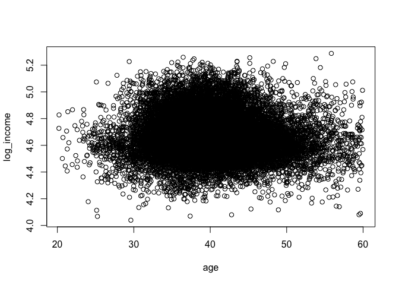
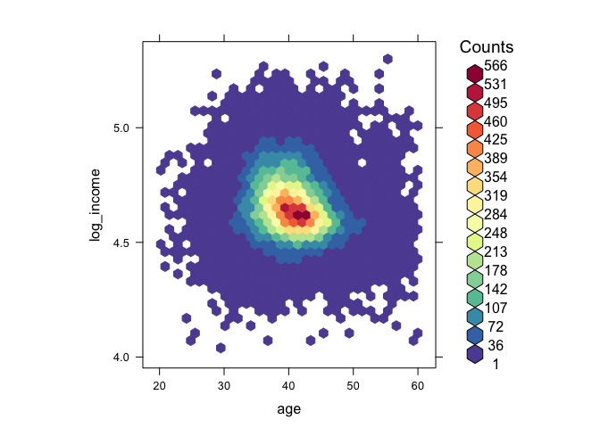
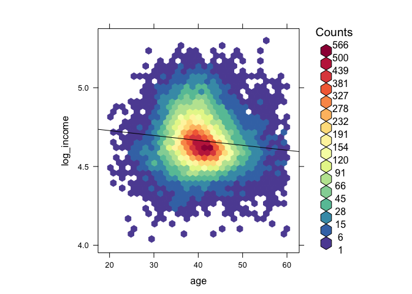
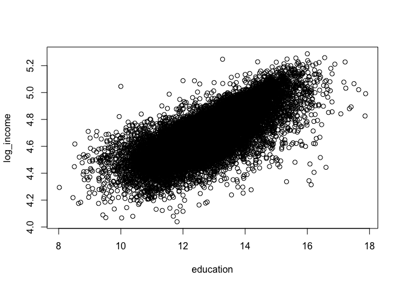
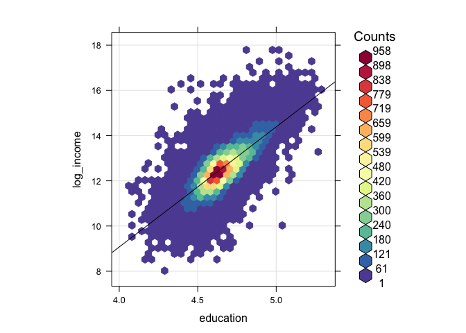
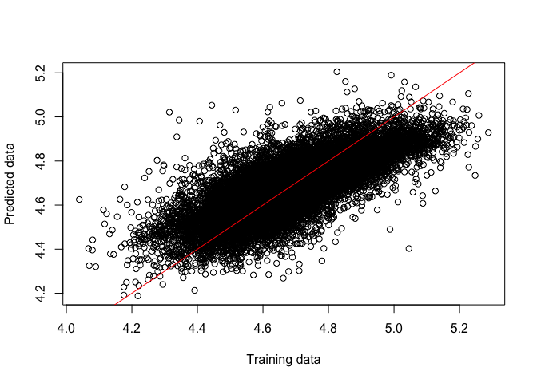
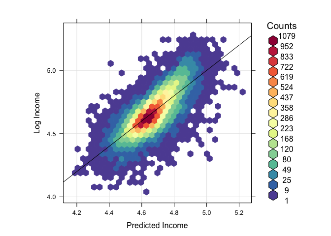

Lab 6
================
Yakovenko Ivan
11/30/2020

Load zeta dataset, and remove all meanhouseholdincome duplicates (or
more formally only females records should be in the dataset) that does
not have any duplicate rows of data (done in homework 3.2).

``` r
df <- as.data.frame(read.table('https://hyper.mephi.ru/assets/courseware/v1/36b8d9e2f04765276b91998c79d4a607/asset-v1:MEPhIx+CS712DS+2020Fall+type@asset+block/zeta.csv', header = TRUE, sep = ','))

head(df, n=10)
```

    ##     X zcta sex  meanage meaneducation meanemployment meanhouseholdincome
    ## 1   1  602   F 37.40335     10.912822      0.7400294            18533.84
    ## 2   2  602   M 35.93574     10.692618      1.3438833            18533.84
    ## 3   3  604   F 31.80943     13.913371      1.0858555            40784.49
    ## 4   4  604   M 31.10425     14.264654      1.6025594            40784.49
    ## 5   5  606   F 35.99079     10.097773      0.6287526            17496.53
    ## 6   6  606   M 35.99027      9.927995      1.2169643            17496.53
    ## 7   7  610   F 37.26014     10.969157      0.8543247            19416.41
    ## 8   8  610   M 36.80649     10.850965      1.2955239            19416.41
    ## 9   9  612   F 40.42732     11.575772      0.7815393            21607.34
    ## 10 10  612   M 37.69992     11.391897      1.2723553            21607.34

``` r
library(dplyr)
```

    ## 
    ## Attaching package: 'dplyr'

    ## The following objects are masked from 'package:stats':
    ## 
    ##     filter, lag

    ## The following objects are masked from 'package:base':
    ## 
    ##     intersect, setdiff, setequal, union

``` r
df <- df[!duplicated(df[ , c("meanhouseholdincome")]),]
head(df, n=10)
```

    ##     X zcta sex  meanage meaneducation meanemployment meanhouseholdincome
    ## 1   1  602   F 37.40335      10.91282      0.7400294            18533.84
    ## 3   3  604   F 31.80943      13.91337      1.0858555            40784.49
    ## 5   5  606   F 35.99079      10.09777      0.6287526            17496.53
    ## 7   7  610   F 37.26014      10.96916      0.8543247            19416.41
    ## 9   9  612   F 40.42732      11.57577      0.7815393            21607.34
    ## 11 11  616   F 38.24761      10.99235      0.7437151            17243.75
    ## 13 13  622   F 42.59515      11.15270      0.8582248            23200.96
    ## 15 15  624   F 34.21463      11.20447      0.6917640            18032.09
    ## 17 17  638   F 35.62713      10.85684      0.6221983            17908.28
    ## 19 19  646   F 37.25719      11.85254      0.8958583            27246.44

Remove the columns zcta and sex from the imported table.

``` r
df2 <- df[!names(df) %in% c("zcta", "sex", "X")]
head(df2, n=10)
```

    ##     meanage meaneducation meanemployment meanhouseholdincome
    ## 1  37.40335      10.91282      0.7400294            18533.84
    ## 3  31.80943      13.91337      1.0858555            40784.49
    ## 5  35.99079      10.09777      0.6287526            17496.53
    ## 7  37.26014      10.96916      0.8543247            19416.41
    ## 9  40.42732      11.57577      0.7815393            21607.34
    ## 11 38.24761      10.99235      0.7437151            17243.75
    ## 13 42.59515      11.15270      0.8582248            23200.96
    ## 15 34.21463      11.20447      0.6917640            18032.09
    ## 17 35.62713      10.85684      0.6221983            17908.28
    ## 19 37.25719      11.85254      0.8958583            27246.44

Remove outliers by creating subsets of the original data so that: `8 <
meaneducation < 18` `10,000 < meanhouseholdincome < 200,000` `0 <
meanemployment < 3` `20 < meanage < 60`

``` r
clear_df <-subset(df2, 
         8 < meaneducation & meaneducation < 18 & 
         10000 < meanhouseholdincome & meanhouseholdincome < 200000 & 
         0 < meanemployment & meanemployment < 3 & 
         20 < meanage & meanage < 60)
head(clear_df, n=10)
```

    ##     meanage meaneducation meanemployment meanhouseholdincome
    ## 1  37.40335      10.91282      0.7400294            18533.84
    ## 3  31.80943      13.91337      1.0858555            40784.49
    ## 5  35.99079      10.09777      0.6287526            17496.53
    ## 7  37.26014      10.96916      0.8543247            19416.41
    ## 9  40.42732      11.57577      0.7815393            21607.34
    ## 11 38.24761      10.99235      0.7437151            17243.75
    ## 13 42.59515      11.15270      0.8582248            23200.96
    ## 15 34.21463      11.20447      0.6917640            18032.09
    ## 17 35.62713      10.85684      0.6221983            17908.28
    ## 19 37.25719      11.85254      0.8958583            27246.44

Create a variable called log\_income = log10(meanhouseholdincome)

``` r
ready_df <- cbind(clear_df, log10(clear_df$meanhouseholdincome))
head(ready_df, n=10)
```

    ##     meanage meaneducation meanemployment meanhouseholdincome
    ## 1  37.40335      10.91282      0.7400294            18533.84
    ## 3  31.80943      13.91337      1.0858555            40784.49
    ## 5  35.99079      10.09777      0.6287526            17496.53
    ## 7  37.26014      10.96916      0.8543247            19416.41
    ## 9  40.42732      11.57577      0.7815393            21607.34
    ## 11 38.24761      10.99235      0.7437151            17243.75
    ## 13 42.59515      11.15270      0.8582248            23200.96
    ## 15 34.21463      11.20447      0.6917640            18032.09
    ## 17 35.62713      10.85684      0.6221983            17908.28
    ## 19 37.25719      11.85254      0.8958583            27246.44
    ##    log10(clear_df$meanhouseholdincome)
    ## 1                             4.267966
    ## 3                             4.610495
    ## 5                             4.242952
    ## 7                             4.288169
    ## 9                             4.334601
    ## 11                            4.236632
    ## 13                            4.365506
    ## 15                            4.256046
    ## 17                            4.253054
    ## 19                            4.435310

Rename the columns meanage, meaneducation, and meanemployment as age,
education, and employment, respectively

``` r
colnames(ready_df) <- c("age", "education", "employment", "meanhouseholdincome", "log_income")
head(ready_df, n=10)
```

    ##         age education employment meanhouseholdincome log_income
    ## 1  37.40335  10.91282  0.7400294            18533.84   4.267966
    ## 3  31.80943  13.91337  1.0858555            40784.49   4.610495
    ## 5  35.99079  10.09777  0.6287526            17496.53   4.242952
    ## 7  37.26014  10.96916  0.8543247            19416.41   4.288169
    ## 9  40.42732  11.57577  0.7815393            21607.34   4.334601
    ## 11 38.24761  10.99235  0.7437151            17243.75   4.236632
    ## 13 42.59515  11.15270  0.8582248            23200.96   4.365506
    ## 15 34.21463  11.20447  0.6917640            18032.09   4.256046
    ## 17 35.62713  10.85684  0.6221983            17908.28   4.253054
    ## 19 37.25719  11.85254  0.8958583            27246.44   4.435310

\#\#Linear Regression Analysis

`a.` We will be analyzing this data with income as the dependent
variable and the other columns as independent variables. Create a
scatter plot showing the effect age has on log\_income and paste it
here. Do you see any linear relationship between the two variables?

``` r
plot(ready_df$age, ready_df$log_income, xlab="age", ylab="log_income")
library(hexbin)
```

<!-- -->

``` r
library(RColorBrewer)
my_colors=colorRampPalette(rev(brewer.pal(11,'Spectral')))
hexbinplot( ready_df$log_income ~ ready_df$age, xlab="age", ylab="log_income", colramp=my_colors)
```

<!-- -->

``` r
hexbinplot(ready_df$log_income ~ ready_df$age, trans = sqrt, inv = function(x) x^2, type = c("q","r"), xlab="age", ylab="log_income", colramp=my_colors)
```

<!-- -->

`b.` Create a linear regression model between log\_income and age. What
is the interpretation of the t-value? What kind of t-value would
indicate a significant coefficient?

``` r
results <- lm(formula=log_income ~ age, data=ready_df)
summary(results)
```

    ## 
    ## Call:
    ## lm(formula = log_income ~ age, data = ready_df)
    ## 
    ## Residuals:
    ##      Min       1Q   Median       3Q      Max 
    ## -0.65841 -0.08285 -0.01632  0.07196  0.67224 
    ## 
    ## Coefficients:
    ##              Estimate Std. Error t value Pr(>|t|)    
    ## (Intercept)  4.790303   0.006530  733.57   <2e-16 ***
    ## age         -0.003124   0.000160  -19.52   <2e-16 ***
    ## ---
    ## Signif. codes:  0 '***' 0.001 '**' 0.01 '*' 0.05 '.' 0.1 ' ' 1
    ## 
    ## Residual standard error: 0.1367 on 31200 degrees of freedom
    ## Multiple R-squared:  0.01207,    Adjusted R-squared:  0.01204 
    ## F-statistic: 381.1 on 1 and 31200 DF,  p-value: < 2.2e-16

`c.` R-squared is a goodness-of-fit measure for linear regression
models. This statistic indicates the percentage of the variance in the
dependent variable that the independent variables explain collectively.
R-squared measures the strength of the relationship between your model
and the dependent variable on a convenient 0 – 100% scale.

Usually, the larger the R<sup>2</sup>, the better the regression model
fits your observations.

`d.` The F critical value is also called the F statistic. If your
calculated F value in a test is larger than your F statistic, you can
reject the null hypothesis. However, the statistic is only one measure
of significance in an F Test. You should also consider the p value. The
p value is determined by the F statistic and is the probability your
results could have happened by chance.

To get strong model F-statictic should be much bigger than 1 and p-value
should be small.

`e.` Multiple R-squared: 0.01207, Adjusted R-squared: 0.01204 R-value is
near 0, that means model is not a good fit.

`f.` Create a scatter plot showing the effect education has on
log\_income. Do you see any linear relationship between the two
variables?

``` r
plot(ready_df$education, ready_df$log_income, xlab="education", ylab="log_income")
```

<!-- -->

``` r
hexbinplot(ready_df$education ~ ready_df$log_income, xlab="education", ylab="log_income", trans = sqrt, inv = function(x) x^2, type = c("q","r"), colramp=my_colors)
```

<!-- -->

`g.` Analyze a detailed summary of a linear regression model between
log\_income and education. What is the R-squared value? Is the model a
good fit? Is it better than the previous model?

Now we have: Multiple R-squared: 0.5412, Adjusted R-squared: 0.5411

That is better -\> R-value closer to 1. Model is better.

``` r
results2 <- lm(formula=log_income ~ education, data=ready_df)
summary(results2)
```

    ## 
    ## Call:
    ## lm(formula = log_income ~ education, data = ready_df)
    ## 
    ## Residuals:
    ##      Min       1Q   Median       3Q      Max 
    ## -0.70802 -0.05338  0.00025  0.05772  0.64667 
    ## 
    ## Coefficients:
    ##              Estimate Std. Error t value Pr(>|t|)    
    ## (Intercept) 3.3804843  0.0067103   503.8   <2e-16 ***
    ## education   0.1018431  0.0005309   191.8   <2e-16 ***
    ## ---
    ## Signif. codes:  0 '***' 0.001 '**' 0.01 '*' 0.05 '.' 0.1 ' ' 1
    ## 
    ## Residual standard error: 0.09313 on 31200 degrees of freedom
    ## Multiple R-squared:  0.5412, Adjusted R-squared:  0.5411 
    ## F-statistic: 3.68e+04 on 1 and 31200 DF,  p-value: < 2.2e-16

`h.` Analyze a detailed summary of a linear regression model between the
dependent variable log\_income, and the independent variables age,
education, and employment. Is this model a good fit? Why? What
conclusions can be made about the different independent variables?

Here we have R-value \~ 0,57 that is closer to 1, high F-value and very
small p-value. That means model is a good fit.

``` r
results3 <- lm(formula=log_income ~ age + education + employment, data=ready_df)
summary(results3)
```

    ## 
    ## Call:
    ## lm(formula = log_income ~ age + education + employment, data = ready_df)
    ## 
    ## Residuals:
    ##      Min       1Q   Median       3Q      Max 
    ## -0.70684 -0.05005  0.00070  0.05198  0.64269 
    ## 
    ## Coefficients:
    ##               Estimate Std. Error t value Pr(>|t|)    
    ## (Intercept)  3.5064582  0.0076317  459.46   <2e-16 ***
    ## age         -0.0026786  0.0001114  -24.04   <2e-16 ***
    ## education    0.0920728  0.0005997  153.53   <2e-16 ***
    ## employment   0.0658663  0.0019683   33.46   <2e-16 ***
    ## ---
    ## Signif. codes:  0 '***' 0.001 '**' 0.01 '*' 0.05 '.' 0.1 ' ' 1
    ## 
    ## Residual standard error: 0.08958 on 31198 degrees of freedom
    ## Multiple R-squared:  0.5755, Adjusted R-squared:  0.5754 
    ## F-statistic: 1.41e+04 on 3 and 31198 DF,  p-value: < 2.2e-16

`i.` by `9%` would income increase for every unit of education
completed, while all other independent variables remained constant.

`j.` Create a graph that contains a y = x line and uses the multiple
regression model to plot the predicted data points against the actual
data points of the training set.

``` r
#library(ggplot2)
#ggplot
ready_df["predict"] <- predict(results3, ready_df)
plot(ready_df$log_income, ready_df$predict, ylab="Predicted data", xlab="Training data")
abline(a=0, b=1, col="red")
```

<!-- -->

``` r
hexbinplot(ready_df$log_income ~ ready_df$predict, ylab="Predicted data", xlab="Training data", trans = sqrt, inv = function(x) x^2, type = c("q","r"), colramp=my_colors)
```

<!-- -->

`k.` As we see on plot y=x is almost repeat our predicted\_data \~
training\_data plot
