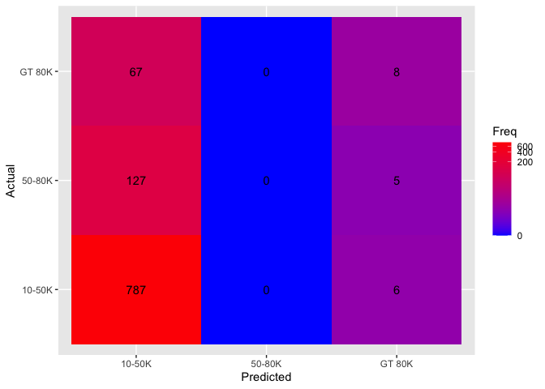
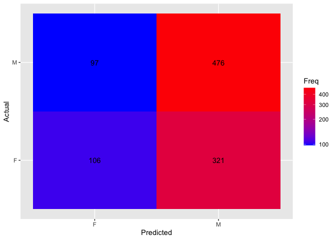

# Lab_8

Yakovenko Ivan
12/13/2020

# Firstly we need to load data

```r
nbtrain <- read.csv(
        file = "https://hyper.mephi.ru/assets/courseware/v1/66b19c28d0c9940f359aa6da5ad25a3b/asset-v1:MEPhIx+CS712DS+2020Fall+type@asset+block/nbtrain.csv",
        sep = ","
)
head(nbtrain)
```

    ##     age sex   educ income
    ## 1 GT 45   M Others 10-50K
    ## 2 GT 45   F Others 10-50K
    ## 3 GT 45   F Others 10-50K
    ## 4 31-45   F Others 10-50K
    ## 5 GT 45   M Others 10-50K
    ## 6 20-30   M Others 10-50K

\#Then we divide data frame to trainning and testing dataset

```r
traindata <- as.data.frame(nbtrain[1:9010,])
testdata <- as.data.frame(nbtrain[9011:10010,])
```

    ## Loading required package: e1071

    ## Loading required package: ggplot2

# We use naiveBayes algorithm to count probabilities and create our model

P(C|A) = (P(A|C)\*P(C))/P(A)

```r
model <- naiveBayes(as.factor(income) ~ age+sex+educ, traindata)
model
```

    ##
    ## Naive Bayes Classifier for Discrete Predictors
    ##
    ## Call:
    ## naiveBayes.default(x = X, y = Y, laplace = laplace)
    ##
    ## A-priori probabilities:
    ## Y
    ##     10-50K     50-80K     GT 80K
    ## 0.80266371 0.12563818 0.07169811
    ##
    ## Conditional probabilities:
    ##         age
    ## Y             20-30      31-45      GT 45
    ##   10-50K 0.20796460 0.34457965 0.44745575
    ##   50-80K 0.08303887 0.39752650 0.51943463
    ##   GT 80K 0.06811146 0.34055728 0.59133127
    ##
    ##         sex
    ## Y                F         M
    ##   10-50K 0.4798119 0.5201881
    ##   50-80K 0.2871025 0.7128975
    ##   GT 80K 0.2058824 0.7941176
    ##
    ##         educ
    ## Y           College     Others   Prof/Phd
    ##   10-50K 0.24585177 0.73976770 0.01438053
    ##   50-80K 0.49558304 0.44257951 0.06183746
    ##   GT 80K 0.53869969 0.29566563 0.16563467

# Model let us use the prediction on our testing dataset

```r
results <- predict(model,testdata)
table(results)
```

    ## results
    ## 10-50K 50-80K GT 80K
    ##    981      0     19

# Confusion matrix gives us graphical representation of our prediction

Here we can see that our prediction give 0 to people with 50-80K income
and that is not true

```r
confusion_matrix <- as.data.frame(table(results, testdata$income))

ggplot(data = confusion_matrix,
       mapping = aes(x = results,
                     y = Var2)) +
  geom_tile(aes(fill = Freq)) +
  geom_text(aes(label = Freq)) +
  scale_fill_gradient(low = "blue",
                      high = "red",
                      trans = "log1p") +
  labs(x = "Predicted", y = "Actual")
```

<!-- --> \#
Misclassification rate To count it we use formula: 1-target/sum

```r
tab <- table(testdata$income,results)
all_miss <- 1 - (sum(diag(tab)) / sum(tab))
miss_10_50 <- 1 - (tab[1,1] / sum(tab[1,]))
miss_50_80 <- 1 - (tab[2,2] / sum(tab[2,]))
miss_gt_80 <- 1 - (tab[3,3] / sum(tab[3,]))
cat('for overall ')
```

    ## for overall

```r
all_miss
```

    ## [1] 0.205

```r
cat('for 10-50K ')
```

    ## for 10-50K

```r
miss_10_50
```

    ## [1] 0.007566204

```r
cat('for 50-80K ')
```

    ## for 50-80K

```r
miss_50_80
```

    ## [1] 1

```r
cat('for GT 80K ')
```

    ## for GT 80K

```r
miss_gt_80
```

    ## [1] 0.8933333

# Naive Bayes for sex

now we create model for formula `sex ~ age + educ + income`

```r
model2 <- naiveBayes(as.factor(sex) ~ age + educ + income, traindata)
model2
```

    ##
    ## Naive Bayes Classifier for Discrete Predictors
    ##
    ## Call:
    ## naiveBayes.default(x = X, y = Y, laplace = laplace)
    ##
    ## A-priori probabilities:
    ## Y
    ##       F       M
    ## 0.43596 0.56404
    ##
    ## Conditional probabilities:
    ##    age
    ## Y       20-30     31-45     GT 45
    ##   F 0.1802444 0.3475051 0.4722505
    ##   M 0.1837859 0.3536009 0.4626131
    ##
    ##    educ
    ## Y      College     Others   Prof/Phd
    ##   F 0.32128310 0.65707739 0.02163951
    ##   M 0.28040142 0.68103109 0.03856749
    ##
    ##    income
    ## Y       10-50K     50-80K     GT 80K
    ##   F 0.88340122 0.08273931 0.03385947
    ##   M 0.74025974 0.15879575 0.10094451

```r
results2 <- predict(model2,testdata)
tab2 <- table(testdata$sex,results2)
all_miss2 <- 1 - (sum(diag(tab2)) / sum(tab2))
miss_f <- 1 - (tab2[1,1] / sum(tab2[1,]))
miss_m <- 1 - (tab2[2,2] / sum(tab2[2,]))
cat('for overall ')
```

    ## for overall

```r
all_miss2
```

    ## [1] 0.418

```r
cat('for female ')
```

    ## for female

```r
miss_f
```

    ## [1] 0.7517564

```r
cat('for male ')
```

    ## for male

```r
miss_m
```

    ## [1] 0.1692845

# And plot second confusion matrix

```r
confusion_matrix2 <- as.data.frame(table(results2, testdata$sex))

ggplot(data = confusion_matrix2,
       mapping = aes(x = results2,
                     y = Var2)) +
  geom_tile(aes(fill = Freq)) +
  geom_text(aes(label = Freq)) +
  scale_fill_gradient(low = "blue",
                      high = "red",
                      trans = "log1p") +
  labs(x = "Predicted", y = "Actual")
```

<!-- -->

# Test our model

we prepare data set: get 3500 from Male and 3500 from Female with random
and bind them then we create `new_model` and count as previous our
misclassification rate

```r
f_data <- traindata[traindata$sex == 'F',]
m_data <- traindata[traindata$sex == 'M',]
library('dplyr')
```

    ##
    ## Attaching package: 'dplyr'

    ## The following objects are masked from 'package:stats':
    ##
    ##     filter, lag

    ## The following objects are masked from 'package:base':
    ##
    ##     intersect, setdiff, setequal, union

```r
f_data <- sample_n(f_data, 3500)
m_data <- sample_n(m_data, 3500)
union_data <- rbind(f_data, m_data)

new_model <- naiveBayes(as.factor(sex) ~ age + educ + income, union_data)
new_model
```

    ##
    ## Naive Bayes Classifier for Discrete Predictors
    ##
    ## Call:
    ## naiveBayes.default(x = X, y = Y, laplace = laplace)
    ##
    ## A-priori probabilities:
    ## Y
    ##   F   M
    ## 0.5 0.5
    ##
    ## Conditional probabilities:
    ##    age
    ## Y       20-30     31-45     GT 45
    ##   F 0.1762857 0.3537143 0.4700000
    ##   M 0.1828571 0.3511429 0.4660000
    ##
    ##    educ
    ## Y      College     Others   Prof/Phd
    ##   F 0.31971429 0.65857143 0.02171429
    ##   M 0.27457143 0.68857143 0.03685714
    ##
    ##    income
    ## Y       10-50K     50-80K     GT 80K
    ##   F 0.88314286 0.08314286 0.03371429
    ##   M 0.74542857 0.15428571 0.10028571

```r
results3 <- predict(new_model,testdata)
tab3 <- table(testdata$sex,results3)
all_miss3 <- 1 - (sum(diag(tab3)) / sum(tab3))
miss_f <- 1 - (tab3[1,1] / sum(tab3[1,]))
miss_m <- 1 - (tab3[2,2] / sum(tab3[2,]))
cat('for overall ')
```

    ## for overall

```r
all_miss2
```

    ## [1] 0.418

```r
cat('for female ')
```

    ## for female

```r
miss_f
```

    ## [1] 0.1358314

```r
cat('for male ')
```

    ## for male

```r
miss_m
```

    ## [1] 0.7190227

# Conclusion

Naive Bayes is interesting algorithm, that can create interesting and in
many cases useful models.
