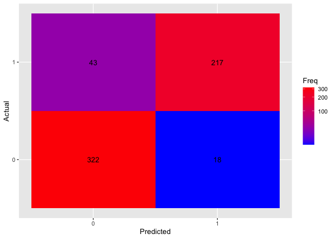

# Lab_9

Yakovenko Ivan
12/21/2020

# Let’s load data

```r
survey <- read.csv(
        file = "https://hyper.mephi.ru/assets/courseware/v1/345e8b1c6ea11120575066ec4ac58f4a/asset-v1:MEPhIx+CS712DS+2020Fall+type@asset+block/survey.csv",
        sep = ",",
        header = TRUE
)
head(survey)
```

    ##   MYDEPV Price Income Age
    ## 1      1    10     33  37
    ## 2      0    20     21  55
    ## 3      1    30     59  55
    ## 4      1    20     76  44
    ## 5      0    30     24  37
    ## 6      0    20     22  32

Create test and training datasets

```r
traindata <- as.data.frame(survey[1:600,])
testdata <- as.data.frame(survey[601:750,])
```

    ## Loading required package: rpart

    ## Loading required package: rpart.plot

    ## Loading required package: ROCR

    ## Loading required package: ggplot2

Let’s see on summary

```r
cat("Train data\n")
```

## Train data

```r
summary(traindata)
```

    ##      MYDEPV           Price           Income           Age
    ##  Min.   :0.0000   Min.   :10.00   Min.   :17.00   Min.   :18.00
    ##  1st Qu.:0.0000   1st Qu.:10.00   1st Qu.:28.00   1st Qu.:32.00
    ##  Median :0.0000   Median :20.00   Median :33.00   Median :32.00
    ##  Mean   :0.4333   Mean   :20.03   Mean   :42.44   Mean   :36.14
    ##  3rd Qu.:1.0000   3rd Qu.:30.00   3rd Qu.:55.00   3rd Qu.:43.00
    ##  Max.   :1.0000   Max.   :30.00   Max.   :99.00   Max.   :66.00

```r
cat("Test data\n")
```

## Test data

```r
summary(testdata)
```

    ##      MYDEPV           Price           Income          Age
    ##  Min.   :0.0000   Min.   :10.00   Min.   :20.0   Min.   :18.00
    ##  1st Qu.:0.0000   1st Qu.:10.00   1st Qu.:29.0   1st Qu.:27.00
    ##  Median :0.0000   Median :20.00   Median :34.0   Median :32.00
    ##  Mean   :0.4267   Mean   :19.87   Mean   :42.7   Mean   :35.33
    ##  3rd Qu.:1.0000   3rd Qu.:30.00   3rd Qu.:55.0   3rd Qu.:43.00
    ##  Max.   :1.0000   Max.   :30.00   Max.   :97.0   Max.   :66.00

# Creating model

Here we use traindata to create our model

```r
fit <- rpart(as.factor(MYDEPV) ~ Price + Income + Age, method="class",
data=traindata, parms=list(split='information'))
printcp(fit)
```

    ##
    ## Classification tree:
    ## rpart(formula = as.factor(MYDEPV) ~ Price + Income + Age, data = traindata,
    ##     method = "class", parms = list(split = "information"))
    ##
    ## Variables actually used in tree construction:
    ## [1] Age    Income Price
    ##
    ## Root node error: 260/600 = 0.43333
    ##
    ## n= 600
    ##
    ##         CP nsplit rel error  xerror     xstd
    ## 1 0.692308      0   1.00000 1.00000 0.046685
    ## 2 0.025000      1   0.30769 0.31154 0.032194
    ## 3 0.011538      3   0.25769 0.25769 0.029672
    ## 4 0.010256      5   0.23462 0.28846 0.031157
    ## 5 0.010000     11   0.17308 0.27692 0.030615

# Plotting tree

```r
rpart.plot(fit, type=4, extra=1)
```

<!-- -->

# Confusion matrix

```r
pred3 = predict(fit, traindata, type="class")
confusion_matrix <- as.data.frame(table(as.factor(pred3), traindata$MYDEPV))
ggplot(data = confusion_matrix,
       mapping = aes(x = Var1,
                     y = Var2)) +
  geom_tile(aes(fill = Freq)) +
  geom_text(aes(label = Freq)) +
  scale_fill_gradient(low = "blue",
                      high = "red",
                      trans = "log1p") +
  labs(x = "Predicted", y = "Actual")
```

<!-- -->

# Misclassification rate

we count it as was shown in Lab8: For first tree using train data

```r
tab <- table(traindata$MYDEPV,pred3)
all_miss <- 1 - (sum(diag(tab)) / sum(tab))
miss_zero <- 1 - (tab[1,1] / sum(tab[1,]))
miss_one <- 1 - (tab[2,2] / sum(tab[2,]))

cat('for overall ')
```

## for overall

```r
all_miss
```

    ## [1] 0.075

```r
cat('for zero ')
```

## for zero

```r
miss_zero
```

    ## [1] 0.07647059

```r
cat('for one ')
```

## for one

```r
miss_one
```

    ## [1] 0.07307692

# Plot the ROC Curve

First get all the probability scores on the training data

```r
pred = predict(fit, type="class")
```

Create predictions object (it used for ROCR classifiers)

```r
predObj = prediction(as.numeric(pred), traindata$MYDEPV)
```

We now create the ROC curve object (for plot) and the AUC object with
performance function

```r
rocObj = performance(predObj, measure="tpr", x.measure="fpr")
aucObj = performance(predObj, measure="auc")
```

And we get AUC

```r
auc = aucObj@y.values[[1]]
auc
```

    ## [1] 0.9252262

So let’s plot it

```r
plot(rocObj, main = paste("Area under the curve:", auc))
```

<!-- -->

# Misclassification rate for test

And let’s create this rates using testdata

```r
pred4 = predict(fit, testdata, type="class")
tab <- table(testdata$MYDEPV,pred4)
all_miss <- 1 - (sum(diag(tab)) / sum(tab))
miss_zero <- 1 - (tab[1,1] / sum(tab[1,]))
miss_one <- 1 - (tab[2,2] / sum(tab[2,]))

cat('for overall ')
```

## for overall

```r
all_miss
```

    ## [1] 0.1066667

```r
cat('for zero ')
```

## for zero

```r
miss_zero
```

    ## [1] 0.1162791

```r
cat('for one ')
```

## for one

```r
miss_one
```

    ## [1] 0.09375

# Gini tree

Creating model using Gini splitting index

```r
fit2 <- rpart(MYDEPV ~ Price + Income + Age, method="class",
data=traindata, parms=list(split='gini'))
printcp(fit2)
```

    ##
    ## Classification tree:
    ## rpart(formula = MYDEPV ~ Price + Income + Age, data = traindata,
    ##     method = "class", parms = list(split = "gini"))
    ##
    ## Variables actually used in tree construction:
    ## [1] Age    Income Price
    ##
    ## Root node error: 260/600 = 0.43333
    ##
    ## n= 600
    ##
    ##         CP nsplit rel error  xerror     xstd
    ## 1 0.692308      0   1.00000 1.00000 0.046685
    ## 2 0.025000      1   0.30769 0.31154 0.032194
    ## 3 0.011538      3   0.25769 0.25769 0.029672
    ## 4 0.010256      5   0.23462 0.26923 0.030244
    ## 5 0.010000     11   0.17308 0.26538 0.030055

# Plot our tree

```r
rpart.plot(fit2, type=4, extra=1)
```

<!-- -->

As we see there is no difference

# Pruning Tree

We use prune function with `cp = 0.011538` as it is CP for minimum `xerror`
in previous cell

```r
pruned = prune(fit2, cp = 0.011538)
rpart.plot(pruned, type=4, extra=1)
```

<!-- -->

# Score Your Final Model

and we again count our Misclassification rates and build Yet Another
Confusion matrix

```r
pred6 = predict(pruned, traindata, type="class")
confusion_matrix <- as.data.frame(table(as.factor(pred6), traindata$MYDEPV))
ggplot(data = confusion_matrix,
       mapping = aes(x = Var1,
                     y = Var2)) +
  geom_tile(aes(fill = Freq)) +
  geom_text(aes(label = Freq)) +
  scale_fill_gradient(low = "blue",
                      high = "red",
                      trans = "log1p") +
  labs(x = "Predicted", y = "Actual")
```

<!-- -->

```r
pred8 = predict(pruned, traindata, type="class")
tab2 <- table(traindata$MYDEPV,pred8)
all_miss2 <- 1 - (sum(diag(tab2)) / sum(tab2))
miss_zero2 <- 1 - (tab2[1,1] / sum(tab2[1,]))
miss_one2 <- 1 - (tab2[2,2] / sum(tab2[2,]))

cat('for overall ')
```

## for overall

```r
all_miss2
```

    ## [1] 0.1016667

```r
cat('for zero ')
```

## for zero

```r
miss_zero2
```

    ## [1] 0.05294118

```r
cat('for one ')
```

## for one

```r
miss_one2
```

    ## [1] 0.1653846

# Conclusion

Results are a bit improved but both models are quite simmilar. Decision
Trees are interesting algorithm which can also visualize data.
