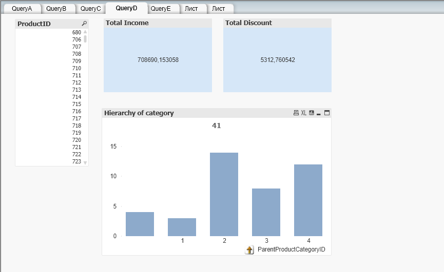

# Report for Lab13 in QlikView

## Task

This task was similar as first one in Lab12. We should create dashboards in QlikView according to tasks A-F in the part about cube and rollup functions.

We have used same data from Azure example SalesLT.

### 1. Create following dashboards in QlikView:

- A. Report about income from sales by product, client and sales person. Please mind discounts.

- B. Report about income from sales by product, client and country (region) for billing, shipping and client residency as they can be different. Is it case according our data? But you should generalize in any case. Please mind discounts.

- C. Report about income from sales and provided discounts by location in form of hierarchy city>state/province>country/region. In that report you can rely on unique geographical names, but in general it is not the case. T

- D. Report about income from sales and provided discounts by product and hierarchy of product categories (high level category-> next level category->...->low level category->product). Please mind that some products can be outside (any) category or be only partially categorized (be not in low level of hierarchy). You can rely on you data to solve to solve this task (especially on that how much subcategories in the current data set), but try to think how to solve this task in general (with arbitrary category tree).

- E. Create integral report on number of product sales by product, client, sales person and hierarchy of regions.

### 2. Create at least two dashboards in QlikView that support some additional analysis on your choice.

- In the first my own dashboard your can get analystics about sex of customers. There are the fields for CustomerID, Title, ProductID and Qty of orders. According to this data you can see diagram that shows distribution for customers' choice by their sex. It can be useful to make more correct product layout and advertisment.

- In the second dashboard your can get analystics about discounts for customers by salaes person. The more discounts customer receives, the more loyal client he becomes.

